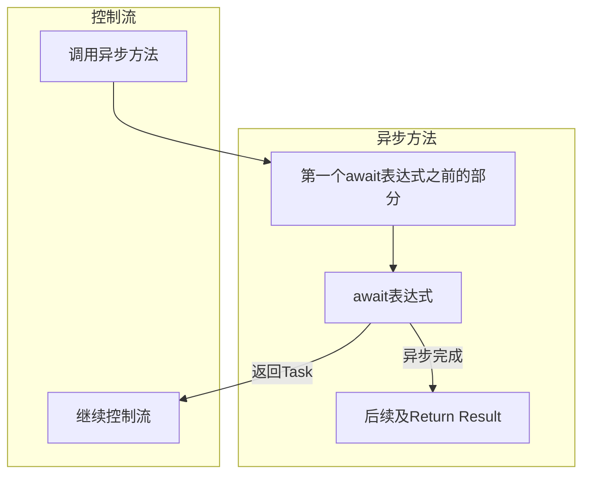

# 1.什么是异步
## 1.概念
程序启动时，会在内存中创建程序的进程，进程是构成运行程序的资源的集合。包括：
- 虚拟地址空间
- 文件句柄
- 程序运行的其他资源

进程内部会有一个被称线程的内核对象，代表真正的程序本身：
- 默认一个进程只有一个线程，从程序开始直到结束
- 线程可以派生出其他线程，因此在任意时刻，一个进程都可能包含不同状态的多个线程，他们执行程序的不同部分。
- 如果一个程序拥有多个线程，他们会共享进程的资源。
- CPU默认调度单元时线程。

在程序的功能中，有些方法可能会需要等待，那么我们可以使用异步，先跳过需要等待的部分，继续执行其他部分，最后在等待结束后继续执行之前的部分，这将大大优化程序的执行效率。

##  2.异步方法async/await结构

在C#中使用异步编程主要是应用具有async/await的异步方法；

一个异步方法具有以下典型特征：
- 在方法头中使用**async修饰符**
- 在方法体中具有**await语句**
	- 一个await语句表示一个异步任务
	- 一个异步方法中可以具有多个await语句
- 返回类型为
	- **Task** 
		- Task表示返回的是Task类型，Task类型是一个异步类，可以具有不同的方法、属性：
			- Status可以获取异步任务的状态
			- wait()方法，可以让执行流等待异步方法完成后再继续
		- 返回Task类型没有返回值，不能有Return语句返回Result属性
	- **Task\<T>**
		- Task\<T>类型大体与Task类型一致，
		- 区别是它支持Result属性，使用Return语句返回值后，使用`task.Result`来获取返回值
	- **ValueTask\<T>**
		- ValueTask\<T>与Task、Task\<T>的区别是ValueTask\<T>是值类型--结构体。
		- ValueTask\<T>是存储在栈中的，在某些情况下他可以节省内存，提升程序性能。
		- ValueTask\<T>是结构因此它也具有一些属性和方法。如常见的Status和wait方法。
	- **void**
		- void值没有返回类型，它指在开始异步任务后就不再与其互动，也没有返回值了。


- 异步方法的形参可以是任意类型、数量，但不可以是out 和 ref
- 异步方法名最后必**以Async为后缀**


除此之外**Lambda表达式也可以异步处理**


示例**Task\<T>**:
```C#
using System;
using System.Numerics;
using System.Threading.Tasks;

class Program
{
    static class DoAsyncStuff
    {
        public static async Task<int> CalculateSumAsync(int i1, int i2)
        {
            int sum = await Task.Run(() => GetSum(i1, i2)); //使用Task.Run()定义异步方法
            return sum;
        }

        private static int GetSum(int i1, int i2) { return i1 + i2; }
    }

    static void Main()
    {
        Task<int> value = DoAsyncStuff.CalculateSumAsync(3, 7);

        Console.WriteLine($"value : {value.Result}"); //使用Result获取返回值
    }
}

```

- **Task\<T>** ：有返回值，使用Result属性获取


示例Task:
```C#
using System;
using System.Threading.Tasks;


class Program
{
    static void Main()
    {
        Task someTask = DoAsyncStuff.CalculateSumAsync(5, 6);

        someTask.Wait();  //可以使用Task调用其中的方法
        Console.WriteLine("Async stuff is done");
    }

    static class DoAsyncStuff
    {
        public static async Task CalculateSumAsync(int i1, int i2)
        {
            int value = await Task.Run(() => GetSum(i1, i2));
            Console.WriteLine("Value : {0}", value);
            // Task返回类型没有返回值
        }
        private static int GetSum(int i1 ,int i2) { return i1 + i2; }
    }
}
```


示例ValueTask:
```C#
using System;
using System.Threading.Tasks;

class Program
{
    static void Main()
    {
        ValueTask<int> value = DoAsyncStuff.CalculateSumAsync(3, 7);
        Console.WriteLine($"Value : {value.Result}");
        value = DoAsyncStuff.CalculateSumAsync(5, 6);
        Console.WriteLine($"Value: {value.Result}");
    }

    static class DoAsyncStuff
    {
        public static async ValueTask<int> CalculateSumAsync(int i1, int i2)
        {
            if (i1 == 0)
            {
                return i2;
            }
            int sum = await Task<int>.Run(() => GetSum(i1, i2));
            return sum;
        }
        private static int GetSum(int i1, int i2) { return i1 + i2; }
    }
}
```
- 此时ValueTask\<int>是结构体


示例Void
```C#
using System;
using System.Threading;
using System.Threading.Tasks;


class Program
{

    static void Main()
    {
        DoAsyncStuff.CalculateSumAsync(5, 6);

        Thread.Sleep(1000);
        Console.WriteLine("Program Exiting");
    }

    static class DoAsyncStuff
    {
        public static async void CalculateSumAsync(int i1, int i2)
        {
            int value = await Task.Run(() => GetSum(i1, i2));
            Console.WriteLine("Value: {0}", value);
        }
    }
    private static int GetSum(int i1, int i2) { return i1 + i2; }
}

```


# 2.异步方法控制流


- 控制流第一次遇到await表达式**会返回Task对象，会包含需要异步完成的任务和后续**
- 异步任务完成后会遇到后续和Return部分:
	- 如果还有await表达式则继续之前的流程
	- 对于Task\<T>和ValueTask\<T>使用Return定义Result属性
	- 控制流在遇到Return后会退出该方法
- 当在后续使用Task的Result属性，**如果异步方法未完成控制流会等待异步方法设置Result属性，然后再继续**


# 3.await表达式
## 1.await表达式
语法
`await Task`

Task即为一个 awaitable 类型，也称为一个任务，它本质是awaitable类型的实例；

一个awaitable类型的实例是一个包含GetAwaiter方法的类型，它包含以下成员：
- bool IsCompleted {get;}
- void OnCompleted(Action);
- 包含以下成员之一
	- void GetResult();  Task返回类型
	- T  GetResult();  
		- T为任意类型

我们通常不需要自己构建awaitable，直接使用Task或ValueTask类即可，他们即使awaitable类型；
使用微软提供的一些异步方法可以满足大部分需求。

## 2.使用Task.Run()方法创建Task

### 1.Task Run()语法
当需要构建自己的异步方法时，我们可以使用Task.Run()方法来生成。


**Task.Run()在不同线程上运行你的方法：**

语法：
`Task Run( Func<TReturn> func)`


Task.Run()返回通过预定义的Func委托来创建你的异步方法，它支持带有返回值

简单的示例：
```C#
using System;
using System.Threading.Tasks;

class Myclass
{
    public int Get10()
    {
        return 10;
    }

    public async Task DoWorkAsync()
    {
        Func<int> ten = new Func<int>(Get10);
        int a = await Task.Run(ten);

        int b = await Task.Run(new Func<int>(Get10));

        int c = await Task.Run(() => { return 10; });

        Console.WriteLine($"{a} {b} {c}");  
    }
}

class Program
{
    static void Main()
    {
        Task t =(new Myclass()).DoWorkAsync();
        t.Wait();
    }
}
```


### 2.Task.Run()的重载方法

对于Task.Run(Func\<TReturn>)
1.可以使用不同的标准委托重载
- Action 委托 void 类型
- TResult Func()委托， TResult返回类型
- Task Func()委托， 返回类型为Task类型
- Task\<T> Func()委托，返回类型为Task\<T>类型

2.增加第二个参数
四种不同委托都可以增加 `CancellationToken token`参数

示例:
```C#
using System;
using System.Threading.Tasks;

static class MyClass
{
    public static async Task DoWorkAsync()
    {
        await Task.Run(() => Console.WriteLine(5.ToString())); //Action

        Console.WriteLine((await Task.Run( () => 6)).ToString()); // TResult Func() 返回的是一个类型值

        await Task.Run(() => Task.Run(() => Console.WriteLine("7"))); //Task Func(),返回的是一个Task

        int value = await Task.Run(() => Task.Run(() => 8)); // Task<TResult> Func(),返回的是Task<TResult>

        Console.WriteLine(value.ToString());

    }

}

class Program
{
    static void Main()
    {
        Task t = MyClass.DoWorkAsync();
        t.Wait();
        Console.WriteLine("Press Any ke to exit");
        Console.Read();
    }
}
```

### 3.添加参数的方法

对于需要输入方法的情况，可以使用Lambda表达式委托，在Lambda表达式中调用另一个方法带有参数的方法即可

```C#
using System;
using System.Threading.Tasks;

class Myclass
{
    public int GetSum(int i1 , int i2)
    {
        return i1 + i2;
    }

    public async Task DoWorkAsync()
    {
    int value = await Task.Run(() => GetSum(5,6));

        Console.WriteLine($"value.ToString()");  
    }
}

class Program
{
    static void Main()
    {
        Task t =(new Myclass()).DoWorkAsync();
        t.Wait();
    }
}
```

# 4.取消一个异步操作

C# 中使用类 `CancellationToken`和`CancellationTokenSource`来实现取消异步操作

CancellationToken
- bool类型的**IsCancellationRequested**属性，当其值为True任务需要停止操作并返回
- CancellationToken是不可逆的，只能使用一次。当IsCancellationRequested属性设置为true后就不能改变了

CancellationTokenSource
- 该对象创建可分配给不同任务的CancellationToken对象
- 持有该类的对象都可以调用其Cancel方法，其可以将CancellationToken的IsCancellationRequested属性设置为true
	- 此时所有由该Source生成的token的IsCancellationRequested属性都会标记为true


示例：
```C#
using System;
using System.Threading.Tasks;

class Program
{
    static void Main()
    {
        CancellationTokenSource cts = new CancellationTokenSource();
        CancellationToken token = cts.Token;

        Myclass myclass = new Myclass();
        Task t = myclass.RunAsync(token);

        Thread.Sleep(3000);
        cts.Cancel(); //此时cts关联的所有token都会标记为Cancel

        t.Wait(); 

        Console.WriteLine($"Was Cancaleed: {token.IsCancellationRequested}");   


    }
}

class Myclass
{
    public async Task RunAsync(CancellationToken ct)
    {
        if (ct.IsCancellationRequested) return;   //检查Method运行之前是否取消

        await Task.Run(()  => CycleMethod(ct), ct);
    }

    void CycleMethod(CancellationToken ct)
    {
        Console.WriteLine("Start CycleMethod");
        const int max = 5;
        for (int i = 1; i <= max; i++)
        {
            if(ct.IsCancellationRequested) return;//检测在Method运行中是否取消

            Thread.Sleep(1000);

            Console.WriteLine($" {i} of {max} iterations completed");
        }
    }
}

```

## 异常处理和await表达式


# 5. 在调用方法中等待任务

## 1.在调用方法中同步等待任务
### 1.wait()方法
在调用异步方法后会返回Task对象，此时程序控制流会执行程序其他部分。
特定的，当我们想等待某个异步方法运行结束后再继续控制流，我们可以使用`Task.Wait()`方法

`Task.Wait()`可以让控制流等待直到该Task的异步任务完成为止。

示例：
```C#
using System;
using System.Numerics;
using System.Threading.Tasks;

class Program
{
    static class DoAsyncStuff
    {
        public static async Task<int> CalculateSumAsync(int i1, int i2)
        {
            int sum = await Task.Run(() => GetSum(i1, i2)); //使用Task.Run()定义异步方法
            return sum;
        }

        private static int GetSum(int i1, int i2) { return i1 + i2; }
    }

    static void Main()
    {
        Task<int> value = DoAsyncStuff.CalculateSumAsync(3, 7);
		value.Wait();

        Console.WriteLine($"value : {value.Result}"); //使用Result获取返回值
    }
}
```

这里当value任务结束后，才会打印Result；

### 2.等待一组对象

#### 1.waitAll()和WaitAny()的用法
使用
`WaitAll(t1, t2...)；`
等待所有组内成员任务完成

`WaitAny(t1, t2...);`
等待组内任意一个成员完成即可
可以等待一组Task对象


```C#
using System;
using System.Net;
using System.Diagnostics;
using System.Threading.Tasks;

class MyDownloadString
{
    Stopwatch sw = new Stopwatch();

    public void DoRun()
    {
        sw.Start();
        Task<int> t1 = CountCharactersAsync(1, "http://www.microsoft.com");
        Task<int> t2 = CountCharactersAsync(2, "http://www.baidu.com");

        //Task.WaitAll(t1, t2);
        //Task.WaitAny(t1, t2);

        Console.WriteLine("Task 1: {0}Finished", t1.IsCompleted ? "" : "Not");
        Console.WriteLine("Task 2: {0}Finished", t2.IsCompleted ? "" : "Not");

        Console.Read();

    }

    private async Task<int> CountCharactersAsync(int id, string site)
    {
        WebClient wc1 = new WebClient();
        string result = await wc1.DownloadStringTaskAsync(new Uri(site));
        Console.WriteLine(" Call{0} completed:  {1, 4:N0} ms", id, sw.Elapsed.TotalMilliseconds);

        return result.Length;
    }

}


class Program
{
    static void Main()
    {
        MyDownloadString ds = new MyDownloadString();
        ds.DoRun();
    }
}

```

- 使用`Task.WaitAll(t1,t2);`
```C#
 Call2 completed:   221 ms
 Call1 completed:   239 ms
Task 1: Finished
Task 2: Finished
```
那么t1,t2任务全部完成之后才会结束

- 使用`Task.WaitAny(t1, t2);`
```C#
 Call2 completed:   220 ms
Task 1: NotFinished
Task 2: Finished
 Call1 completed:   236 ms
```
此时等待了t2完成就继续控制流了


#### 2.WaitAll()和WaitAny()的重载方法


WaitAll()重载方法:

| 签名                                                                                  | 描述                                                                     |
| ----------------------------------------------------------------------------------- | ---------------------------------------------------------------------- |
| void WaitAll(params Task\[] tasks)                                                  | 等待所有任务完成                                                               |
| bool WaitAll(Task\[] tasks, <br>int millisecondsTimeout)                            | 等待所有任务完成,如果在规定时限没有<br>完成则返回false                                       |
| bool WaitAll(Task\[] tasks,<br>CancellationToken token)                             | 等待所有任务完成，<br>或者等待CancellationToken发出取消信号                               |
| bool WaitAll(Task\[] tasks,<br>TimsSpan span)                                       | 等待所有任务完成，如果在超过TimsSpan生成的时限内<br>未完成则返回false                            |
| bool WaitAll(Task\[] tasks,<br>int millisecondsTimeout,<br>CancellationToken token) | 等待所有任务完成，<br>或等待CancellationToken发出取消信号<br>如果在超过时限内没有达成上诉情况之一，则返回false |

WaitAny()重载方法与上面一致，只是将WaitAll()换为WaitAny();


## 2.在调用方法中异步等待任务

### 1.`WhenALl()`

会并行的等待所有任务完成，相比与顺序的等待，可以大大节省时间

**场景1：不使用 `WhenAll()`（顺序等待）**
```
await t1;  // 等待 t1 完成（1秒）
await t2;  // 等待 t2 完成（2秒）
// 总耗时：1 + 2 = 3秒
```

- **行为**：`t1` 和 `t2` **串行执行**，总耗时是两者之和。
- **问题**：如果 `t1` 和 `t2` 是独立的（例如两个网络请求），这种写法浪费性能。

 **场景2：使用 `WhenAll()`（并发等待）**
```C#
await Task.WhenAll(t1, t2);  
// 总耗时：max(1, 2) = 2秒
```
- **行为**：`t1` 和 `t2` **并行执行**，总耗时是两者中较长的那个。
- **优势**：最大化利用并发性，减少总耗时。


### 2.`WhenAny()`
并行的等待任意一个任务完成，
也是与上面一致是并行的等待其中一个任务完成


WhenAll()、WhenAny()会等待一组任务：
- 这组任务以(t1,t2,t3...)来提供
- 返回的即是异步方法的返回值，因为在任务结束后才会返回

```C#
using System;
using System.Net;
using System.Diagnostics;
using System.Threading.Tasks;

class MyDownloadString
{
    Stopwatch sw = new Stopwatch();

    public async Task DoRun()
    {
        sw.Start();
        Task<int> t1 = CountCharactersAsync(1, "http://www.microsoft.com");
        Task<int> t2 = CountCharactersAsync(2, "http://www.baidu.com");

        int[] tasks = await Task.WhenAll(t1, t2); //这里会异步等待所有任务完成，而控制流直接执行其他任务


        Console.WriteLine("Task 1: {0}Finished", t1.IsCompleted ? "" : "Not");
        Console.WriteLine("Task 2: {0}Finished", t2.IsCompleted ? "" : "Not");

      


    }

    private async Task<int> CountCharactersAsync(int id, string site)
    {
        WebClient wc1 = new WebClient();
        string result = await wc1.DownloadStringTaskAsync(new Uri(site));
        Console.WriteLine(" Call{0} completed:  {1, 4:N0} ms", id, sw.Elapsed.TotalMilliseconds);

        return result.Length;
    }

}


class Program
{
    static void Main()
    {
        MyDownloadString ds = new MyDownloadString();
        ds.DoRun();
        Console.Read(); //如果没有这行代码，则程序直接结束没有任何输出
    }
}
```

此时会异步的等待t1，t2完成，再执行后面的代码。


# 6. await Task.Delay()异步休眠方法

Task.Delay()可以暂停其在线程的处理，但他不会阻塞线程，线程的控制流会继续进行。

示例:
```C#
using System;
using System.Diagnostics;
using System.Threading.Tasks;

class Simple
{
    Stopwatch sw = new Stopwatch();

    public void DoRun()
    {
        Console.WriteLine("Caller : Before call");
        ShowDelayAsync();
        Console.WriteLine("Caller: After call");
    }

    private async void ShowDelayAsync()
    {
        sw.Start();
        Console.WriteLine($"    Before Delay :{sw.ElapsedMilliseconds}");
        await Task.Delay( 1000 );
        Console.WriteLine($"    After Dealy : {sw.ElapsedMilliseconds}");
        
    }
}

class Program
{
    static void Main()
    {
        Simple ds = new Simple();
        ds.DoRun();
        Console.Read();
    }
}


Caller : Before call
    Before Delay :0
Caller: After call
    After Dealy : 1016
```


Task.Delay()方法通常task发布一个异步计时任务，
当计时完成，会通过回调函数将异步任务完成加入到线程池，从而不会阻塞主线程。


Task.Delay()方法的重载：

| 签名                                          | 描述                                                                 |
| ------------------------------------------- | ------------------------------------------------------------------ |
| Task.Delay(int millisecondsDelay)           | 通过毫秒的方法计时                                                          |
| Task.Delay(TimeSpan delay)                  | 通过TimeSpan 方法产生计时时间                                                |
| Task.Delay(delay, CancellationToken  token) | delay是通过millisecondsDelay或TimeSpan生成的延迟<br><br>加入token参数允许提前结束计时操作 |


> [!info] Thread.Sleep()
>  Thread.Sleep() 会在阻塞主线程的情况下计时操作；


# 7.await Task.Yield() 切换主线程控制权方法

执行Task.Yield()方法的主要作用就是交出主线程的控制权，
主线程控制器返回调用异步方法处；
当主线程有空闲时继续处理异步方法后面的部分。

```C#
using System;
using System.Threading.Tasks;

class Program
{
    static void Main()
    {
        Console.WriteLine("运行主线程:...");
        DoAsyncWork();
        Console.WriteLine("继续运行主线程:...");

        Console.ReadLine();

    }

    static async Task DoAsyncWork()
    {
        Console.WriteLine("异步任务开始..");
        for (int i = 1; i <= 5; i++)
        {
            if (i == 3)
            {
                await Task.Yield();  //当i==3时交出异步方法控制权限
            }

            Console.WriteLine($"   {i} of 5 Steps in Main Program.");
            Thread.Sleep(1000);

        }
        
    }

}

运行主线程:...
异步任务开始..
   1 of 5 Steps in Main Program.
   2 of 5 Steps in Main Program.
继续运行主线程:...
   3 of 5 Steps in Main Program.
   4 of 5 Steps in Main Program.
   5 of 5 Steps in Main Program.
```

# 8.异步Lambda表达式

语法
```C#

Type lambda = async () => 
{
...
await Task;
...
}
```


# 9. BcakgroundWorker类 *


# 10.并行循环

## 1. Parallel.For

语法
`public static ParallelLoopResult.For(int fromInclusive, int toExclusive, Action body)`
- int fromInclusive 迭代的第一个整数
- int toExclusive 迭代的最后一个整数+1  \[ )
- body接受单个输入参数的委托，每迭代一次执行一次

```C#
using System;
using System.Threading.Tasks;

namespace ExampleParallelFor
{
    class Program
    {
        static void Main()
        {
            Parallel.For( 0, 5, i  => Console.WriteLine($"The square of {i} is {i * i}"));
        }
    }
}

The square of 3 is 9
The square of 0 is 0
The square of 2 is 4
The square of 4 is 16
The square of 1 is 1
```


可以看到循环在多核处理器上并行运行，
结果的次序并不是按顺序进行，因为进行了并行的运行。


## 2.Parallel.ForEach

`static ParallelLoopResult ForEach<TSource>(IEnumerable<TSource> source, Action<TSource> body)`
- source时要遍历的可枚举类型Tsource对象
- body是要应用到集合中每个元素上的Lambda表达式，即对每个元素的操作

```C#
using System;
using System.Threading.Tasks;

namespace ParallelForeach1
{
    class Program
    {
        static void Main()
        {
            string[] squares = new string[] { "we", "Hold", "These", "Truths", "to", "be" };

            Parallel.ForEach(squares, x => Console.WriteLine(x));
        }
    }
}

to
we
Hold
Truths
These
be
```

# 11. 计时器 TImer

 介绍System.Threading命名空间中的Timer类计时器：

`Timer( TimerCallback callback, object state, uint dueTime, uint period)`

- TimerCallbcak callbcak是**TimerCallback类型的委托**：
	- `void TimerCallback( object state)` 该类型委托接受一个Object类名为state的参数，并且返回类型为void
	- 这是C#预制的一个转为Timer计时器的委托
	- 使用时直接`TimerCallback timerCallback = new TimerCallback(MethodName);`即可

- object state是每次传入委托的参数，它是object类型
	- state可以是null，传入空引用

- 计时器特性 dueTime， period
	- dueTime首次被调用前的时间
		- 设置为`Timeout.Infinite`时计时器不会开始
	- period两次成功调用回调函数之间的时间间隔
		- 设置为`Timeout.Infinite`时则在首次调用后就不再调用


```C#
using System;
using System.Threading.Tasks;

namespace Timers
{
    class Program
    {
        int TimesCalled = 0;
        void Display(object state)
        {
            Console.WriteLine($"{(string)state} {++TimesCalled}");
        }

        static void Main()
        {
            Program p = new Program();
            Timer myTimer = new Timer(p.Display,"Processing timer event", 2000, 1000);

            Console.WriteLine("Timer Started.");

            Console.ReadLine();

        }
    }
}

------- 使用显式委托的版本
static void Main()
{
    Program p = new Program();
    TimerCallback timerCallback = new TimerCallback(p.Display);
    Timer myTimer = new Timer(timerCallback, "Processing timer event", 2000, 1000);

    Console.WriteLine("Timer Started.");

    Console.ReadLine();
}

Timer Started.
Processing timer event 1
Processing timer event 2
Processing timer event 3
Processing timer event 4
Processing timer event 5
```


