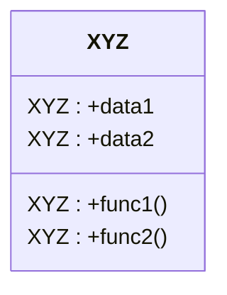
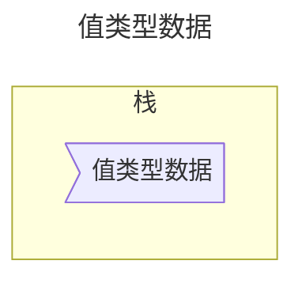
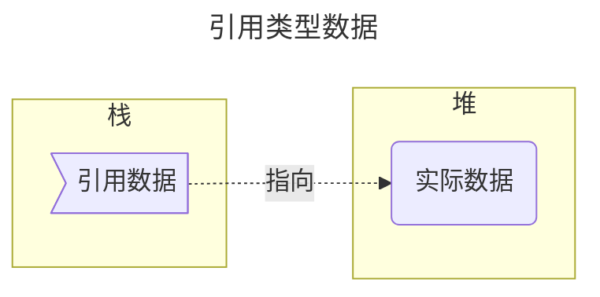
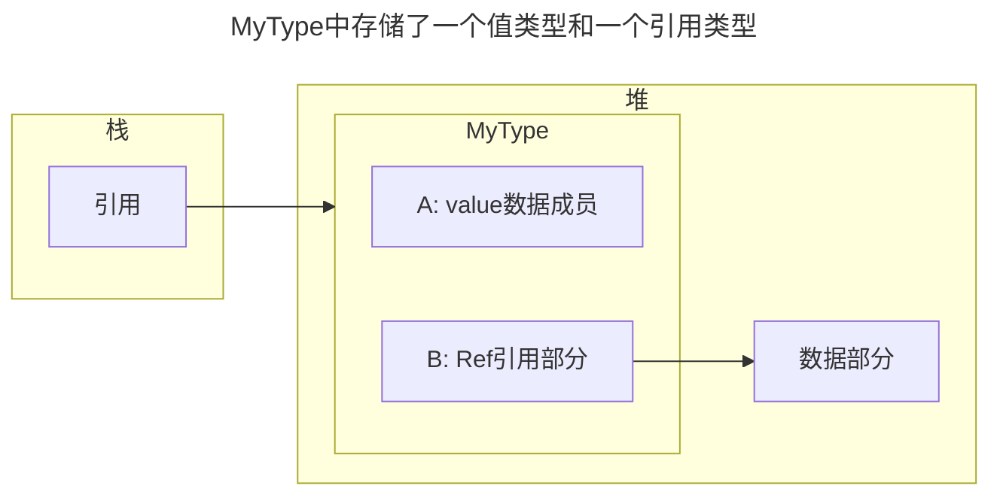
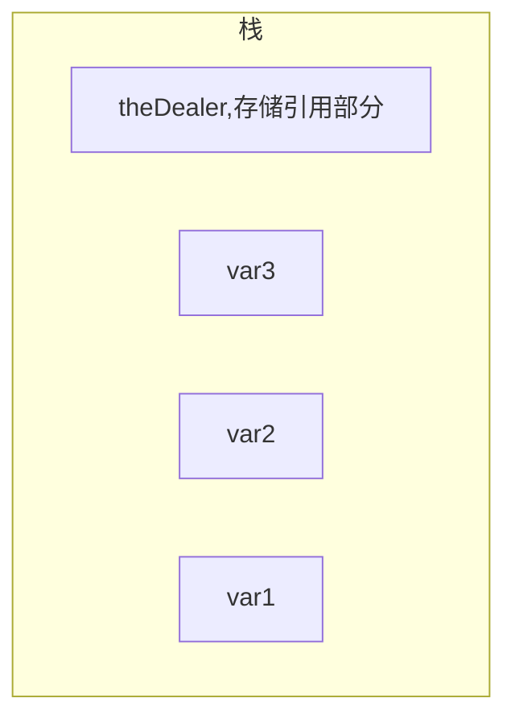
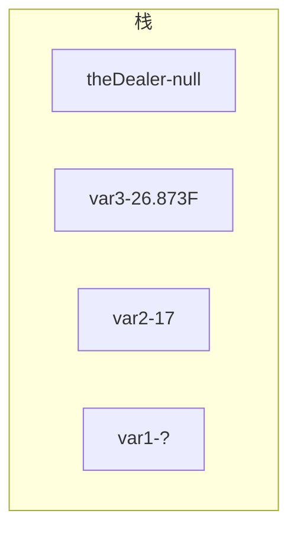

**对比来说，如果C是函数和数据类型，C++是函数和类，C#是一组类型声明**
- 对于可执行程序，类型声明中必须包含Main方法
- 命名空间是一种将相关类型声明分组命名的方法


# 1.类型
既然C#是一组类型声明，那么学习C#就是学习如何创建和使用类型。

## 1.类型是创建数据结构的模板

类型是创建数据结构的模板，它本身不是数据结构，他只是描述了数据结构的特征。
**一个类型由以下元素定义：**
- **类型的名称；**
- **用于保存数据成员的数据结构；**
- **一些行为及约束条件。**


例：简单的类型，数值类型,如short
名称：short
结构：2字节
行为：16位整数

## 2.实例化类型

从某个类型模板创建实际的对象，称为**实例化**该类型。
- 通过实例化类型创建的**对象**或**实例**，这两个术语可互换。
- C#程序中每个数据项都是某种类型的实例。他们可以来自
	- 语言自带
	- BCL或其他库提供的
	- 程序员自定义的

通过short类型创建short实例
通过int类型创建int实例
## 3.简单类型，数组元素和多类型存储


- **简单类型**，如short、int、long只能存储一个数据项。

- **数组元素**-可以存储多个相同类型数据的类型-可以用index导航。

- 存储多个不同类型的数据的类型，这种类型有**两种成员**
	- **数据成员** 保存了与类相关的数据
	- **函数成员** 保持了函数执行代码



## 4.预定义类型
C#有**16种预定义类型**
所有预定义类型都是小写的
预定义类型：
- 简单类型
	- 非数值类型 
		- bool true false
		- char 
	- 数值类型
		- 整数类型
			- byte、sbyte
			- short、ushort
			- int、 uint
			- long、ulong
		- 浮点类型
			- decimal
			- float
			- double
- object 所有其他类型的基类
- string Unicode**字符数组**
- dynamic  动态语言编写的程序集时使用

**预定义简单类型**


| 名称      | 含义                     | 范围                                          | .NET 框架类型      | 默认值    |
| ------- | ---------------------- | ------------------------------------------- | -------------- | ------ |
| sbyte   | 8位有符号整数                | -128~127                                    | System.SByte   | 0      |
| byte    | 8位无符号整数                | 0~255                                       | System.Byte    | 0      |
| short   | 16位有符号整数               | -32768~32767                                | System.Int16   | 0      |
| ushort  | 16位无符号整数               | 0~65535                                     | System.UInt16  | 0      |
| int     | 32位有符号整数               | -2147483648~2147483647                      | System.Int32   | 0      |
| uint    | 32位无符号整数               | 0~4294967295                                | System.UInt32  | 0      |
| long    | 64位有符号整数               | -922337206854775808~<br>9223372036854775807 | System.Int64   | 0      |
| ulong   | 64位无符号整数               | 0~18446744073709551615                      | System.UInt64  | 0      |
| float   | 单精度浮点数                 | 1.5x10^45~3.4x10^38                         | System.Single  | 0.0f   |
| double  | 双进度浮点数                 | 5.10^-324~1.7x10^308                        | System.Double  | 0.0d   |
| bool    | 布尔型                    | true false                                  | System.Boolean | false  |
| char    | Unicode字符              | U+0000~U+ffff                               | System.Char    | \x0000 |
| decimal | 小数类型的有效数精度为28位，常用于货币计算 | 土1.0x10^28~土7.9x10^28                       | System.Decimal | 0m     |
|         |                        |                                             |                |        |

**预定义非简单类型**

| 名称      | 含义                   | .NET框架类型      |
| ------- | -------------------- | ------------- |
| object  | 所有其他类型的基类，包括简单类型     | System.Object |
| string  | 0个或多个Unicode字符所组成的序列 | System.String |
| dynamic | 在使用动态语言编写的程序集时使用     | 无             |


- decimal 是高精度的小数类型。可以准确的表示分数，常用于货币的计算。
- C#中**数值类型不具有bool意义**
- **预定义类型的名称都是小写的！**

## 5.用户定义类型

有6种类型可以由用户自定义：
- class 类类型
- struct 结构类型
- array 数组类型
- enum 枚举类型
- interface 接口类型

类型通过类型声明创造，类型包含声明包含以下信息：
- 类型的**种类**
- 新类型的**名称**
- 对类型中每个**成员声明**（名称和规格）
	- array和delegate类型除外，他们不含有命名成员。

对类型声明后就可创建和使用这些类型：
对于预定义类型，直接实例化即可如 int a；
对于用户自定义类型，需要先对类型进行声明，再进行实例化： 如 class ABC; ABC a1;


# 2.类型的分类：值类型和引用类型

数据项的类型决定了数据的**内存大小**，**数据成员**及**存储位置**--栈和堆。

不同类型存储的位置不同

## 0.栈和堆
运行中的程序**使用两个内存区域来存储数据**： 栈和堆
### 1.栈

栈是一个**内存数组**，是LIFO(Last-In First-Out)结构。
栈存储的数据类型：
- **某些类型变量的值**；
- **程序当前的执行环境**；
- **传递给方法的参数**。

系统管理所有栈操作，程序员了解栈的基本功能能更好的理解程序在运行时做什么。

栈的特征：
- 数据只能从栈顶插入和删除(后入栈的数据先出栈，最开始的数据最后出栈)
- 把数据放入栈顶称为**入栈**(push).
- 从栈顶删除数据被称为**出栈**(pop).


### 2.堆

堆是一块内存区域，在堆里可以分配大块的内存用于存储某种类型的数据对象。
 **堆中可以任意顺序存入和删除数据。**

程序不能显式地删除堆中的数据，**CLR自动垃圾收集器判断程序不再访问某数据时，自动清除无主的堆对象**。


## 1.值类型
- 值类型只需要一段单独的内存用于存放实际的数据。
- 值类型通常存储在栈中。

## 2.引用类型，引用放在栈中，实际数据放在堆中
引用类型需要两段内存空间用于存储
- 第一段存储实际数据，存放于**堆**中
- 第二段是一个引用，**指向**存放堆的**地址**

```mermaid
flowchart LR

```




## 3.存储引用类型对象的成员

当一个引用类型的实例存储了不同类型的成员：
- 引用类型的数据部分始终在堆中。
- 值类型对象、或引用类型的引用部分可以在栈里也可以在堆中，依赖于实际环境。

对于一个引用类型实例Mytype，它有两个成员，一个是值类型一个是引用类型？是否是值类型在栈，而引用类型的引用部分在栈，数据部分在堆呢？ 
答案：不是，对于一个引用类型实例他的数据都放在堆中，即时他的成员也是引用类型。




## 4.C# 类型按值类型和引用类型分类
![[学习/Csharp/图库/C_sharp的类型分类]]
- 简单类型都是值类型

[^1]: 

# 3.变量
变量是一个名称，当程序使用该变量时可以使用该变量指向内存中的数据。C#中变量只是在方法内部使用。

## 1.C#提供四种变量：
- **局部变量** 在方法的作用域保存的临时数据，不是类型的成员。
- **字段** 保存和类型或类型实例相关的数据，是类型成员。
- **参数** 用于从一个方法到另一个方法传递数据的临时变量，不是类型成员
- **数组元素** （通常是）同类数据项构成的有序集合的成员，可以为局部变量，也可以是类型成员。

## 2.变量的声明
### 1.声明
变量在使用前必须声明，声明完成了两件事：
1. 给变量命名，并为它关联一种类型
2. 让编译器为他分配一块内存空间


示例：
```C#
int var1;  //值类型
int var2; //值类型
float var3;  //值类型
Dealer theDealer;  //引用类型
```




### 2.声明并初始化
初始化可以将变量指向的内存初始化为一个特定的值。
int var2 = 17；

局部变量未初始化之前有未定义的值，但在赋值之前不能使用，否则会报错。

```C#
int var1;  //值类型
int var2  = 17; //值类型
float var3 = 26.843F;  //值类型
Dealer theDealer = null;  //引用类型

```



### 3.自动初始化
某些变量没有声明时有默认值，有些变量没有默认值。

| 变量类型 | 存储位置   | 自动初始化 | 用途            |
| ---- | ------ | ----- | ------------- |
| 局部变量 | 栈或者栈和堆 | 否     | 用于函数成员内部的局部计算 |
| 类字段  | 堆      | 是     | 类的成员          |
| 结构字段 | 栈或堆    | 是     | 结构的成员         |
| 参数   | 栈      | 否     | 用于把值传入或传出方法   |
| 数组元素 | 堆      | 是     | 数组的成员         |

## 4.多变量声明
多变量声明的变量类型需相同；
变量名必须用逗号隔开，可以包含初始化语句。
如：
`int var3 = 7, var4, var5 = 3;`
`double var6, var7 = 6.52;`

## 5.静态类型和dynamic关键字
每个变量都包含变量类型，这样，编译器就能确定运行时需要的**内存总量**以及哪些部分应该**存在栈上或堆上**。
变量类型在编译时就确定且不能再运行时修改，这叫做**静态类型**。
**动态类型**，当程序运行时才对其进行确定类型。
**dynamic类型**，C#语言支持的这种dynamic类型会在程序运行时，会对这类型的变量进行确认。

## 6.可空类型

某些情况，如在使用数据库时，你希望表示变量目前未保存有效的值。
引用变量 --> 把变量设置为null即可
值类型变量 --> 通过bool指示器将其设置为一个无效的。

**可空类型**，就是可以通过bool指示器来将值类型设置为有效或无效的两种状态。普通类型的值为非可控类型。