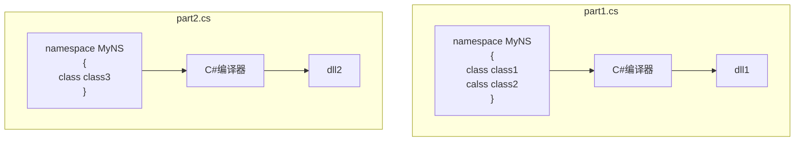

# 1. 引用程序集和NameSpace

## 1.引用程序集和namespace的作用
需要在主项目中引用其他程序集时，我们可以**添加程序集引用Reference**来添加其他的程序集；

如常见的，可以引用一个类库：
- 类库时仅包含类类型的源文件经过编译而成的lib文件，通常时dll类型


**当我们引用不同的类库时，可能会发生类名冲突，则就会导致错误。那么我们就可以使用一个NameSpace限定不同组织的类库；**

NameSpace指一组类或类型的集合：
- 命名空间语法:
```C#
namespce <Name>
{
TypeDeclarations;
}
```
- 命名空间名字：**区分大小写、可以有多个`.`表示不同层级**
- 命名空间名+分割点+类名的完整字符串被称为**类的完全限定名**
- 命名空间的**成员间名字必须不同**；

> [!Example]

```C#
using System;
namespace MyCrop.SuperLib
{
    public class SquareWidet
    {
        public double SideLength = 0;
        public double Area
        {
            get { return SideLength * SideLength; }
        }
    }
}
类库
--------

using System;
using MyCrop.SuperLib;
class Program
{
static void Main()
    {
        MyCrop.SuperLib.SquareWidet sq = new MyCrop.SuperLib.SquareWidet();
        sq.SideLength = 2.0f;
        Console.WriteLine($"{sq.Area}");
    }
}
Main()方法使用完全限定名namespace来使用其他类库的类
----
结果 4
```


## 2.namespace跨文件延伸和嵌套

### 1.命名空间跨文件

命名空间可以跨文件扩展， 在另一个文件中声明相同的namespace，可以在其中添加新的类型。

扩展namespace文件和源namespace文件都可以独立的编译为类库：



### 2.嵌套命名空间
一个源文件中可以有多个命名空间
不同命名空间可以是嵌套关系

有两种嵌套方法
- 直接嵌套
- 分离声明嵌套

**嵌套的命名空间虽然在形式上是嵌套的，但是在使用上命名空间之间是相互独立的。**


>[!Example]

```C#
namespce MyNameSpace
{
class class1

namespce otherNs
{
class class2
}
}
第一种是直接嵌套在第一个命名空间中
----

namespace MyNameSpace
{
class class1
}

namespace MyNameSpace.otherNs
{
class class2
}
第二种是独立的声明，需要使用完全限定名称
```


# 2.using指令

使用using指令将一个加入引用的namespace添加后，可以直接使用该namespace的类而不必使用完全限定名：
- using指令必须**在文件的一开始声明**
- **应用于当前源文件的所有namespace**
- **不使用完全using指令时则必须使用完全限定名来使用引用库的类**


## 1.using命名空间指令

语法:
`using namespce`

```C#
using System
Console.WriteLine();  //直接调用namespace中的类
System.Console.WriteLine(); //不使用using则需要使用完全限定名
```
## 2.using别名指令

**using支持别名，他可以简化一个完整层级的namespace**

支持using别名：
- 命名空间
- 命名空间内的一个类型

示例
```C#
using Syst = System；
using  SC = System.Console;

static void Main()
{
Syst.Console.WriteLine("xx");
System.Console.WriteLine("XXX");
SC.WriteLine("XXXX");
}
```

## 3.using static指令

通过using static指定namespace中特定的类型：类、结构、枚举；
这样可以不带前缀的访问这些类型中的静态成员。
using static仅会导入静态成员；

示例：
```C#
using static System.Math;

var squareRoot = Sqrt(16); //这里直接使用了静态方法，而没有带前缀

---
using Systeml
var squareRoot = Math.Sqrt(16);  //这里需要声明Math类
```


# 3.程序集*

程序集由源代码编译而成，它要么是可执行文件、要么是DLL；
程序集中不是本机代码而是公共中间语言。
程序集包含以下项目：
- 清单
	- 程序集名称，包含简单名称，版本号，文化信息（语言）、公钥
	- 组成程序集的文件列表
	- 本程序引用的其他程序列表
	- 一个表明某个类型包含在那个程序集的地图
- 类型元数据
	- 程序中所有类型的元数据
- CIL代码
	- 公共中间语代码
- 资源
	- 可选的，包含图形或语言资源

标识符

强命名程序集

私有程序集部署

共享程序集和GAC

配置文件

延迟签名