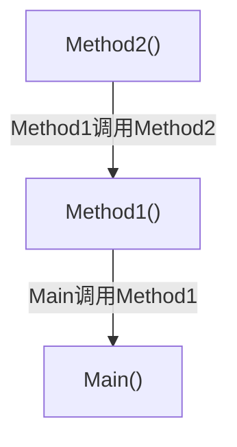

异常是程序运行中出现的错误；当程序产生错误，系统会抛出异常；

异常处理可以用于在：
- 调用可能出现问题的外部资源如外部库、可能出现延迟的网络资源
- 可以避免程序卡死、崩溃等问题
- 可以将异常问题集中输出在一处


# 1. Try语句的组成即异常处理顺序

## 1.try语句的组成
Try语句包含以下部分:

Try语句块：包含可能会出现异常的代码块，并通过Catch、Finally块进行处理；

Catch语句块：Catch子块可以接受Try语句中的错误，并含有异常处理代码；

Finally语句块： 含有无论什么情况都会执行的代码块。


## 2.异常处理顺序

**Try语句**包含可能出现异常的代码块

**当异常发生，按顺序搜索Catch子句列表，执行第一个匹配到的Catch子句**；
因此Catch子句的排列顺序要求：
- **最特殊的异常应该排最前面，其次是稍微普通的异常**
- **如果有一个一般catch子句，它应该排最后一个。同时不鼓励使用一般catch子句，因为它会掩盖可能的其他错误。**

**finally块**，如果存在该块，无论如何finally块都会在最后执行；


如果异常匹配一个catch子句，那么会在异常处理之后返回try语句结尾后（跳过catch部分)
如果有finally块，那么最后会执行finally块再返回。
# 2.异常类

BCL定义了许多异常类，这些类都代表了一种错误。
而当错误发生，CLR创建这些类的异常对象并匹配合适的Catch子句来处理。

## 1.常见异常类列举
 1. **`System.Exception`**

- **基类**：所有异常类的基类。
    
- **用途**：表示程序中的一般性错误。
    

2. **`System.ApplicationException`**

- **用途**：用于应用程序定义的异常，通常由用户自定义异常类继承。
    

3. **`System.SystemException`**

- **用途**：表示由.NET Framework或操作系统引发的异常。
    

4. **`System.ArgumentException`**

- **用途**：表示传递给方法的参数无效。
    
- **派生类**：
    
    - `ArgumentNullException`：参数为 `null`。
        
    - `ArgumentException`：参数值无效。
        
    - `ArgumentOutOfRangeException`：参数超出有效范围。
        

5. **`System.IndexOutOfRangeException`**

- **用途**：表示访问数组或集合时索引超出范围。
    

 6. **`System.InvalidOperationException`**

- **用途**：表示方法调用无效，例如对象状态不正确。
    

7. **`System.IO.IOException`**

- **用途**：表示输入/输出操作失败。
    
- **派生类**：
    
    - `FileNotFoundException`：文件未找到。
        
    - `DirectoryNotFoundException`：目录未找到。
        
    - `IOException`：其他 I/O 错误。
        

8. **`System.NullReferenceException`**

- **用途**：表示尝试访问 `null` 引用的成员。
    

 9. **`System.DivideByZeroException`**

- **用途**：表示除数为零的算术运算。
    

10. **`System.FormatException`**

- **用途**：表示字符串格式无效，例如解析字符串时格式不正确。
    

11. **`System.OverflowException`**

- **用途**：表示算术运算或转换导致溢出。
    

12. **`System.TimeoutException`**

- **用途**：表示操作超时。
    

13. **`System.NotSupportedException`**

- **用途**：表示尝试执行不支持的操作。
    

14. **`System.NotImplementedException`**

- **用途**：表示方法或操作未实现。
    

15. **`System.ObjectDisposedException`**

- **用途**：表示尝试使用已释放的对象。
    

16. **`System.StackOverflowException`**

- **用途**：表示堆栈溢出（通常由于无限递归）。
    

17. **`System.OutOfMemoryException`**

- **用途**：表示内存不足。
    

18. **`System.AccessViolationException`**

- **用途**：表示尝试读取或写入受保护的内存区域。
    

19. **`System.InvalidCastException`**

- **用途**：表示无效的类型转换。
    

20. **`System.OperationCanceledException`**

- **用途**：表示异步操作被取消。


这些对象带有一些只读属性，可以帮助我们定位错误信息：

| 属性             | 类型        | 描述                          |
| -------------- | --------- | --------------------------- |
| Message        | string    | 该属性解释异常发生的原因                |
| StackTrace     | string    | 该属性定位错误发生在何处                |
| InnerException | Exception | 当前异常是由其他异常产生时，该属性包含前一个异常的引用 |
| Source         | string    | 表明这个异常所在程序集的名称              |


所有异常类都派生自System.Exception类；
而System.Exception类又派生自System.Object;


# 3.Catch子句

Catch子句有几种处理异常的形式;
## 1.一般catch子句
```C#
catch
{
statement
}
```
这种类型没有参数，匹配来自try语句中的所有错误

## 2.特定catch子句
```C#
catch (ExceptionType)
{
statement
}
```
匹配指定的异常类型的属性；

## 3.带对象特定catch子句
```C#
catch (ExceptionType ExceptionVariable)
{
Statement
}
```
带有一个局部变量，这个变量是异常对象的引用；
可以通过该局部变量访问异常对象；
如通过对象访问上诉几个常见的只读属性；

## 4.带谓词的特定catch子句
```C#
catch(Exception ExceptionVariable)
when(predicate)
{
Statements;
}
```
匹配指定的异常类型的属性；
带有一个局部变量，这个变量是异常对象的引用；
可以通过该局部变量访问异常对象；
且只有When()结果为true时才能进入子句

when()表达式又可以称为过滤器，它过滤满足特定条件的异常对象
**因此过滤器可以对某个异常的多种错误情况进行细分：**
- **when()表达式必须返回bool值**
- **when()表达式不能是异步的**
- **when()表达式不能执行长时间操作**

>[!Example Of 过滤器]

```C#
try
{

}
catch ( HttpREquestException e) when( e.Messgae.Contains("307"))
{
...
}

catch ( HttpREquestException e) when( e.Messgae.Contains("301"))
{
...
}
```
这里when对HttpREquestException异常对象信息进行细分


>[!Example Of Catch子句]

```C#
using System;

class Program
{
    static void  Main()
    {
        int x = 10;
        try
        {
            int y = 0;
            x /= y;
        }     
        /*
        catch(DivideByZeroException)
        {
            Console.WriteLine("Handing all exceptions - keep on Running");
        }
        */
        catch(DivideByZeroException e)
        {
            Console.WriteLine("Message: {0}", e.Message);
            Console.WriteLine("Source: {0}", e.Source);
            Console.WriteLine("Stack: {0}", e.StackTrace);
        }
         

    }
}

-----OutPut----
Message: Attempted to divide by zero.
Source: CSPractice
Stack:    at Program.Main() in D:\computer_program_practice\C#_practice\CSPractice\Chapter23\try_catch.cs:line 12
```


# 4.finally块

finally块是try语句中始终都会最后执行的部分：
- 当没有catch命中时，会最后执行finally块
- 当有catch命中时，会先执行catch再执行finally
- **特别的，即使try语句中有return语句，也不会影响finally的执行。**

>[!Example Of finally块]

```C#
try
{
if(inVal < 10)
{
Console.Write("First Branch - ");
return;
}
else
	Console.Write("Second Branch-");
}
finally
{
Console.WriteLine("In finally Statement");
}

First Branch - In finally Statement
```


# 5.调用栈搜索

当try语句中的代码发生异常，系统没有在当前try语句的catch子句列中找到异常的处理方法。
- 那么它会顺着[[20.第二十三章 异常#^2dbf88|调用栈]]往后搜索可能匹配的catch子句
- 当发现匹配的catch子句后，它会先返回每一个catch子句块并执行可能存在的finally块（如果没有finally块则跳过)

**调用栈**：
Main()方法调用其他函数是符合栈的规则
当Main()方法中调用一个方法，会将其置入栈定，并会置入执行上下文如局部变量，参数等信息
当这个函数又调用一个方法，那么第二个方法又会置于栈顶；
当然最下面的是Main()方法

^2dbf88


>[!Example of 调用栈搜索]

```C#
using System;
using System.Collections.Generic;
using System.Linq;
using System.Text;
using System.Threading.Tasks;

class Program
{
    static void Main()
    {
        MyClass class1 = new MyClass();
        try
        { class1.Method1(); }

        catch (DivideByZeroException)
        { Console.WriteLine("catch clause in Main()"); }
        finally
        { Console.WriteLine("finally clause in Main()"); }
        Console.WriteLine("After try statement in Main.");
        Console.WriteLine("          --  keep runnning.");
    }
}

class MyClass
{
public void Method1()
    {
        try
        {
            Method2();
        }
        catch (NullReferenceException)
        { Console.WriteLine("catch clause in Method1()"); }
        finally
        {
            Console.WriteLine("finally clause in Method1()");
        }
    }

    void Method2()
    {
        int x = 10, y = 0;
        try
        { x /= y; }
        catch (IndexOutOfRangeException)
        {
            Console.WriteLine("catch clause in Method2()");
        }
        finally
        { Console.WriteLine("finally clause in Method2()"); }
    }
}

-----Output-------
finally clause in Method2()
finally clause in Method1()
catch clause in Main()
finally clause in Main()
After try statement in Main.
          --  keep runnning.
```


# 6.throw语句抛出异常

使用throw语句可以显式的抛出异常，而不是通过try语句被动由系统检测，它有以下的作用：
- 可以自定义一些异常情况（这些异常是BLC中没有的）
- 可以抛出异常对象并统一由catch处理，让异常处理集中于一处
- 可以throw不接异常对象，将当前的异常对象抛出


## 1.throw抛出异常对象

>[!语法]
>
`throw ExceptionObject`

如 
```C#
ArgumentNullException myEx = new ArguementNullException("arg");
throw myEX;
或
throw new ArguementNullException("arg");
```


>[!Example Of throw Object]

```C#
using System;
using System.Collections.Generic;
using System.Linq;
using System.Text;
using System.Threading.Tasks;


class Program
{
    static void Main()
    {
        string s = null;
        MyClass.PrintArg(s);
        MyClass.PrintArg("Hi there!");
        
    }
}

class MyClass
{
    public static void PrintArg(string arg)
    {
        try
        {
            if(arg == null)
            {
                throw new ArgumentNullException("arg"); //这里由throw主动抛出异常
            }
            Console.WriteLine(arg);
        }
        catch(ArgumentNullException e)
        {
            Console.WriteLine($"Message : {e.Message}");
        }
    }
}

---Output---
Message : Value cannot be null. (Parameter 'arg')
Hi there!
```


## 2.不带异常对象的throw

在catch子句中可以使用不带异常对象的throw，这样的throw可以将异常重新抛出，以供其他catch子句处理；
- catch中的throw;是向调用栈的后面抛出，而不是停留在当前catch子句列中；

>[!Example of throw]

```C#
using System;
using System.Collections.Generic;
using System.Linq;
using System.Text;
using System.Threading.Tasks;


class Program
{
    static void Main()
    {
        string s = null;
        MyClass.PrintArg(s);
        MyClass.PrintArg("Hi there!");

    }
}

class MyClass
{
    public static void PrintArg(string arg)
    {
        try
        {
            try
            {
                if (arg == null)
                {
                     
                    throw new ArgumentNullException("arg"); //这里由throw主动抛出异常
                }
                Console.WriteLine(arg);
            }
            catch (ArgumentNullException e)
            {
                Console.WriteLine($"Message : {e.Message}");
                throw;
            }
        }
        catch
        {
            Console.WriteLine("Outer Catch: Handling an Exception.");
        }
    }
}


---OUtput---
Message : Value cannot be null. (Parameter 'arg')
Outer Catch: Handling an Exception.
Hi there!
```

## 3.将throw在表达式中使用

throw不仅能作为一个语句使用，还可以再表达式中使用；


>[!Example of ??]

??  [[../Csharp扩展/空运算符|空运算符]]
```C#
private int mSecurityCode;
public int SecurityCode
{
get =>mSecurityCode;
set =>mSecurityCode = value ??
throw new ArguementNullException("Security Code may not be null");
}
```


>[!Example of  ?  :]

```C#
try
{
string secretCode = safe ? SecretCode : throw new Exception("Not safe to get code.");
}
```