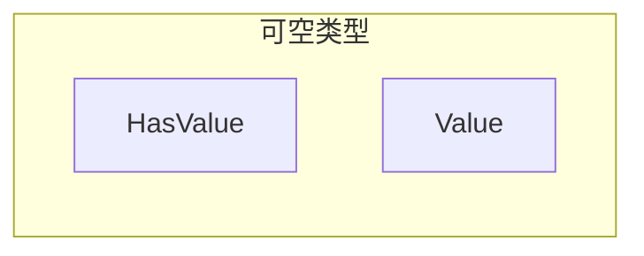
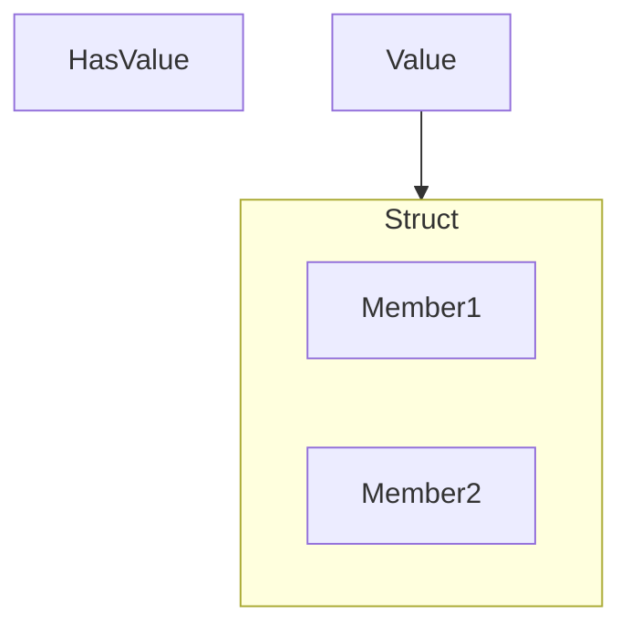
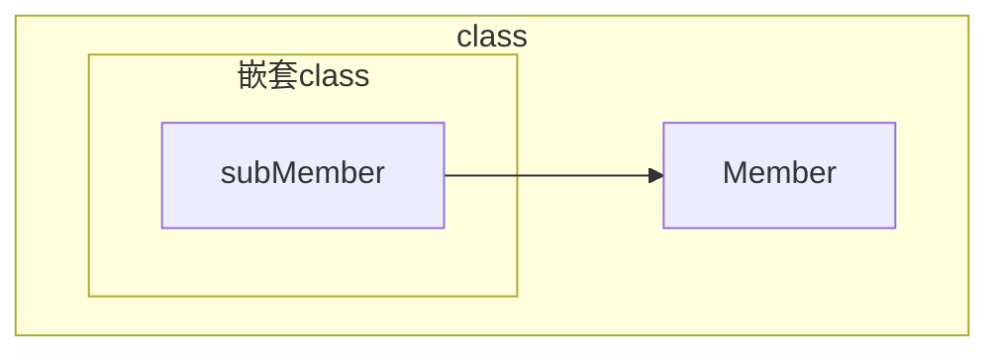
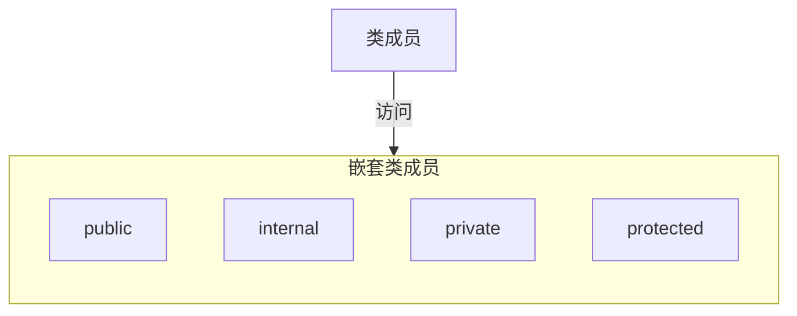

# 1. 字符串

字符串的本质是 Unicode 字符数组；
字符串是不可改变的，对它的处理方法都是生成一个新的副本；


## 1. 创建字符串操作成员
> [!Note 常见字符串操作成员]

| 成员        | 类型   | 意义                                                      |
| --------- | ---- | ------------------------------------------------------- |
| Length    | 属性   | 返回字符串长度                                                 |
| Concat    | 静态方法 | 返回连接参数字符串后的字符串                                          |
| Contains  | 方法   | 返回指示参数是否是对象字符串的子字符串的 bool 值                             |
| Format    | 静态方法 | 返回格式化后的字符串                                              |
| Insert    | 方法   | 接受一个字符串和一个位置参数作为参数，创建并返回一个在指定位置<br>插入了参数字符串的新字符串对象副本    |
| Remove    | 方法   | 返回对象字符串副本，移除了其中一个子字符串                                   |
| Replace   | 方法   | 返回对象字符串副本，其中替换了一个子字符串                                   |
| Split     | 方法   | 返回一个包括原始字符串的子字符串的字符串数组。对于每个输入参数，为<br>方法提供一组分隔符来分隔目标子字符串 |
| Substring | 方法   | 获取对象字符串的子字符串                                            |
| Tolower   | 方法   | 返回对象字符串的副本，其中所有字母字符串都为小写                                |
| ToUpper   | 方法   | 返回对象字符串副本，其中所有字符串都为大写                                   |

> [!Example Of Spilt]
```C#
using System;

class Program
{
    static void Main()
    {
        string s1 = "hi there! this, is: a string.";
        char[] delimiters = { ' ', '!', ',',':','.'};
        string[] words = s1.Split(delimiters, StringSplitOptions.RemoveEmptyEntries);
        Console.WriteLine($"Word Count: {words.Length}\n\rThe Words...");
        foreach (string s in words)
            Console.WriteLine($" {s}");
    }
}

----
Word Count: 6
The Words...
 hi
 there
 this
 is
 a
 string
```

## 2. **StringBuilder 类**

StringBuilder 类可以帮助动态、有效的修改字符串，它可以动态增加数组存储空间，以避免创建许多副本带来的性能损耗；
- StringBuilder 位于 System. Text 命名空间中；
- StringBuilder 对象是 Unicode 字符的可变数组；

> [!Example Of StringBuilder]
```C#
using System;
using System.Text;


class Program
{
    static void Main()
    {
        StringBuilder sb = new StringBuilder("Hi there.");
        Console.WriteLine($"{sb.ToString()}");

        sb.Replace("Hi", "Hello");
        Console.WriteLine($"{sb.ToString()}");
    }
}
---
Hi there.
Hello there.

```
这里 StringBuilder 类型 sb 是动态变化的；


## 3. 把字符串解析为数值

如“25.873”是一个字符串，想将其作为数值使用必须使用方法将其解析为数值；

1. Parse 接收一个字符串，可以将其转换为目标数值类型；
```C#
double d1 = double.Parse("25.873");
```
- 使用需要解析的类型调用 Parse ()
- 接收转换结果

2. TryParse 首先检测目标类型是否可以解析值，如果可以则返回解析的值

```C#
using System;

class Program
{
    static void  Main()
    {
        string parseResultSummary;
        string stringFirst = "28";

        bool success = int.TryParse(stringFirst, out int First);

        parseResultSummary = success ? "was successfully parsed" : "was not successfully parsed";

        Console.WriteLine($"String {stringFirst} {parseResultSummary}");


    }
}

----
String 28 was successfully parsed
```
- 使用转换结果类型名调用 TryParse 方法
- TryParse 返回 bool 类型，如果可以解析则返回 true，如果不能则返回 false；
- TryParse 接收两个参数
	- 第一个参数是需要解析的变量；
	- 第二个参数接收一个 out 参数，如果成功解析则将解析结果传导到 out 变量


# 2. 可空类型

> [!Note]
> 可空类型可以提供值类型 “无值”或 null 的状态，它有以下好处：
> - 字段的值具有默认值，那么使用可空类型可以**定义无值的一种状态**
> - 通过可空即可为 null 状态，方便**统一处理引用类型和数值类型的代码**
> - 在某些情况下可以**表示不确定状态**


## 1. 可空类型定义

使用? 可以将一个**值类型**转换为泛型 `System.Nullable<T>` 结构的实例，**这样的类型实例被称为可空类型；**
可空类型可以将其设置为有效或无效的状态，并且可以赋 null；
这个结构包含两个成员：
1. HasValue ，HasValue 是一个 **bool类型**，它指示值是有效还是无效
	1. 当 HasValue 为 true 时表示该可空类型有效，可以通过 Value 读取值
	2. 当 HasValue 为 false 时，表示该可空无效，没有值；此时 `可空类型 == null` 返回 true；
	3. `可空类型 = null;` 的表达式也是将 HasValue 设定为 false
2. Value，Value 是与基础值类型相同类型的**只读属性**
	1. 如果 HasValue 为 true 则读取 Value 返回值类型值
	2. 如果 HasValue 为 false 则读取 Value 会抛出异常


## 2. 可空类型的使用、赋值和转换

### 1. 可空类型的使用

**可空类型可以通过名字直接获取其值，但在使用前需要判断其是否有效**

```C#
using System;

int? myInt1 = 15;

if(myInt1 != null)  //使用前判断其是否有效，通过其与null对比
{
    Console.WriteLine("{0}", myInt1); //直接使用MyInt1名来读取其值
}
```

### 2. 可空类型的赋值

可以赋给可空类型的类型：
- 相同数值类型的值
- 相同类型的可空类型
- Null

```C#
using System;

int? myI1, myI2, myI3;

myI1 = 28;
myI2 = myI1;
myI3 = null;

Console.WriteLine($"myI1 : {myI1} \nmyI2 : {myI2} \nmyI3 : {myI3}");

----
myI1 : 28
myI2 : 28
myI3 :
```


### 3. 可空类型与值类型的转换

值类型可以隐式转换为可空类型
可空类型必须显式转换为可空类型

```C#
int? myInt1 = 15;
int regInt = (int)myInt1;
```


## 3. 空结合运算符
空结合运算符 ?? ,  当可空类型变量为 null 时，可以返回一个值给表达式;

```C#
using System;

int? myInt = null;
Console.WriteLine("myInt : {0}", myInt ?? -1);

myInt = 10;
Console.WriteLine("myInt : {0}", myInt ?? -1);

----
myInt : -1
myInt : 10
```

如上，当可空类型 myInt 为空时，则返回 -1，不为空时则返回 myInt；
## 4. 空条件运算符

空条件运算符: `?.` 作用于一个**引用类型变量** `引用变量 ?.成员`
- 首先会判断引用变量是否为空
	- 如果为空则运算符返回空
	- 如果不为空着返回成员值
- 当成员为值类型时，**它会返回可空类型的值成员；**

```C#
using System;


Student[] students = null;
int? studentsCount = 5;

if (students != null)
    studentsCount = students.Length;
Console.WriteLine($"studentCount: {studentsCount}");

studentsCount = students?.Length;
Console.WriteLine($"studentsCount: {studentsCount}");


class Student
{
}

----
studentCount: 5
studentsCount:
```
> [!Note]
> ?. 与 if 判断后再赋值的区别：
> ？. 一定会执行赋值语句，要么返回值，要么返回 null
> If 语句判断时，当 test 语句为 false，赋值语句不会执行

当在数组使用时，使用 `Array?[index]` 进行使用
```C#
Student student = student?[7];

var supervisorPhoneNumber = Employ?[0].SuperVisors?[0].PhoneNumbers?[0].ToString();
```
可以在数组中进行链式使用，当一处为 null 则返回 null

空条件运算符常用使用方法：
- 在委托调用，当委托不为空时调用委托；
- 结合空结合运算符使用

```C#
handler?.Invoke(this. argss);

int studentCount = Students?.Count ?? 0;
```
## 5. 使用可空用户定义类型

值类型的用户自定义类型即结构或枚举，
如果不将其声明为可空类型则可直接访问其成员；
但如果将其声明为可空类型，那么只能使用只读属性 Value 访问其成员；

即可空用户自定义类型结构：


```C#
MyStruct中有两个Int成员  X、Y;

MyStruct mSStruct = new MyStruct(6,11);
MyStruct? mSNull = new Mystruct(5, 10);

Console.WriteLine("mSStruct.X : {0}", mSStruct.X);
Console.WriteLine("mSStruct.Y : {0}", mSStruct.Y)

Console.WriteLine("mSNull.X : {0}", mSNUll.Value.X);
Console.WriteLine("mSNull.Y : {0}", mSNUll.Value.Y); //可空类型结构需要使用Value属性访问成员
```


# 3. Main 方法
Main 方法是程序的入口，它可以定义在类或结构中；
有四种合法的 Main () 方法：
- `static void Main`
- `static void Main(string[] args)`
- `static int Main()`
- `static int Main(string[] args)`


返回类型为 int，可以从 Main () 方法返回值，通常报告程序执行成功或失败，成功则返回 0
`string[] args` 用于向程序中传入参数：
 - 参数可以是 0 或多个，0 个参数传入的不是 null 而是一个没有元素的数组
 - 每个参数被程序解读为字符串：
	 - 参数间使用空格或制表符隔开
	 - 不需要为参数添加""

修饰符：
- Public 修饰符表示 Main 方法可以被其他的程序集调用
- Private 修饰符表示 Main 方法无法被其他程序集调用
- 无论如何操作系统总能访问 Main 方法；

```C#
class Program
{
    static void Main(string[] args)
    {
        foreach (string s in args)
            Console.WriteLine(s);

        Console.ReadLine();
    }
}
-----
PS D:\computer_program_practice\C#_practice\CSPractice\chapter27> .\MainTest.exe john davidTim kok
john
davidTim
kok
```
通过 csc 将 Program 编译为 exe 文件然后在调用 `MainText.exe` 方法后面写上需要传入的参数即可


# 4. 文档注释

文档注释允许我们使用 XML 元素的形式为程序添加注释，
VisualStudio 可以从源文件读取 XML 并复制到新文件；


使用///来表示接下来插入一个 XML 文档注释:
- 输入///<选择对应的标签>IDE 会自动完成 XML 结构
```C#
/// <summary>
///
/// </summary>
```

常见的 XML 标签：

| 标签         | 意义                   |
| ---------- | -------------------- |
| \<code>    | 用看上去像代码的字体行添加 XML 注释 |
| \<example> | 将注释标注为一个示例           |
| \<param>   | 为方法或构造函数标注参数，并允许描述   |
| \<remarks> | 描述类型的声明              |
| \<returns> | 描述返回值                |
| \<seealso> | 在输出文档添加 See Also 一项  |
| \<summary> | 描述类型或类型成员            |
| \<value>   | 描述属性                 |


# 5. 嵌套类型

## 1. 嵌套类型定义

嵌套类型指的是，将一个类型封装在另一个类型中。
- 如将一个类、结构、枚举、委托嵌套在一个类或结构中；
- 嵌套类型仅作为外部类型的 private 成员访问
	- 可以帮助外部类型封装代码、整理逻辑，处理外部类型内部的逻辑；
	- 对外部隐藏实现方法
- 虽然嵌套类型是在外部类型的内部声明的，但是它的对象是独立于外部对象的；


嵌套类示例：
```C#
using System;
using System.Collections.Generic;
using System.Linq;
using System.Text;
using System.Threading.Tasks;


class Myclass
{
    private class MyCounter
    {
        public int Count { get; private set; }

        public static MyCounter operator ++(MyCounter current)  //重载运算符++, 返回Count++的类
        {
            current.Count++;
            return current;
        }
    }

    private MyCounter counter;

    public Myclass()  //默认构造函数
    {
        counter = new MyCounter();
    }

    public int Incr() { return (counter++).Count; }  

    public int GetValue() { return counter.Count; }


}

class Program
{
    static void Main()
    {
        Myclass mc = new Myclass(); //通过构造函数声明了嵌套类Mycount对象counter；

        mc.Incr();mc.Incr();  //执行两次++

        Console.WriteLine($"Total: {mc.GetValue()}");
    }
}

----
Total: 2
```

## 2. 嵌套类型的可见性




 因为嵌套类是类的成员，所以嵌套类成员可以访问类的所有成员



类成员可以访问嵌套类本省

类成员 --可以--> public || internal  嵌套类成员；
嵌套类成员的 public 和 internal 范围仅限定于类中；

类成员 --不能--> private || internal 嵌套类成员：
因为 private || internal 嵌套类成员使用范围限定于嵌套类中；


在类中可以使用 this 指代类的引用
```C#
using System;
using System.Collections.Generic;
using System.Linq;
using System.Text;
using System.Threading.Tasks;

class SomeClass
{
    int Field1 = 15, Field2 = 20;
    MyNested mn = null;

    public void PrintMyMembers()
    {
        mn.PrintOuterMembers();
    }


    public SomeClass()
    {
        mn = new MyNested(this);  //这里 this指代SomeClass的对象
    }


    class MyNested
    {
        SomeClass sc = null;
        public MyNested(SomeClass SC)
        {
            sc = SC;
        }

        public void PrintOuterMembers()
        {
            Console.WriteLine($"Field1: {sc.Field1}");
            Console.WriteLine($"Field2: {sc.Field2}");

        }
    }
}

class Program
{
    static void Main()
    {
        SomeClass MySc = new SomeClass();
        MySc.PrintMyMembers();
    }
}
```

# 6. 析构函数

析构函数实现类不在被引用时的非托管资源的释放；
非托管资源指用WIn 32 API 或非托管内存块获取的文件夹句柄这样的资源；
- WIn 32 APi 提供与 Windows 系统交互的函数，如生成一个窗口 CreateWindow；
- 非托管内存块指由 WIn 32 APi 或指针操作生成的内存块；
- 文件句柄指文件信息的标签；


一个类中只能声明一个析构函数且不能有修饰符，参数等，格式必须如下：
`~ClassName() { }`

- 不需要析构函数时不要声明，会严重影响性能；
- 析构函数只处理对象拥有的外部资源；
- 析构函数不应该访问其他对象，因为不确定其他对象是否已经销毁；


由于你不不知道系统何时会调用析构函数清楚非托管资源，而你急需释放时，最好使用
**标准 dispose 模式**

使用 dispose 模式需要实现 IDisposable 接口，包含唯一方法 Dispose，该方法包含释放资源的清楚代码；

这样，类就有两个清楚非托管资源的入口：
- 调用 Dispose 方法清楚资源，调用后使用 GC. SuppressFinalize 方法通知 CLR 不需要再调用对象的析构函数
- 如果 Dispose 方法未被调用，则系统会调用析构函数清楚资源；


```C#
using System;
using System.Collections.Generic;
using System.Linq;
using System.Text;
using System.Threading.Tasks;

class MyClass : IDisposable
{
    bool disposed = false;

    public void Dispose()
    {
        Dispose(true);
        GC.SuppressFinalize(this);

    }

    ~MyClass()
    {
        Dispose(false);
    }

    protected virtual void Dispose(bool disposing)
    {
        if(disposed == false)
        {
            if(disposing == true)
            {
                ..//释放托管资源
            }
            //释放非托管资源
        ....
        }
        disposed = true;
    }
}

```


# 7. 元组 
## 1. 什么是元组
元组是可以存储不同类型元素的轻型结构，元组本身是结构类型，使用公共字段存储元素，所以：
- 元素的数量可以是任意多个
- 元组的元素可以被改变

## 2. 元组的声明、访问和赋值


元组的元素可以使用默认名表示： Item 1, Item 2.... Item n
或者可以为每个元素命名 

示例：
```C#
(double, int) t1 = (4.5, 3);
Console.WriteLine($"Tuple with elements {t1.Item1} and {t1.Item2}");

(double sum, int Count) t2 = (4.5, 3);
Console.WriteLine($"Tuple with elements {t2.sum} and {t2.Count}");

t2.sum = 5;
Console.WriteLine($"Tuple with elements {t2.sum} and {t2.Count}");

---
Tuple with elements 4.5 and 3
Tuple with elements 4.5 and 3
Tuple with elements 5 and 3

```

对于元组，可以使用 Item 1.. Itemn 访问，也可以使用命名的名字访问


## 3. 元组赋值

```C#
(int, double) t1 = (17, 3.14);
(double First, double Second) t2 = (0.0, 1.0);
t2 = t1;
Console.WriteLine($"{nameof(t2)}: {t2.First} and {t2.Second}");
// Output:
// t2: 17 and 3.14

(double A, double B) t3 = (2.0, 3.0);
t3 = t2;
Console.WriteLine($"{nameof(t3)}: {t3.A} and {t3.B}");
// Output:
// t3: 17 and 3.14
```

如果两个元组间元素数量相等，且
- 右值元素类型与左值元素类型相等
- 或右值元素类型可以隐式转换为左值
那么右值元组值可以赋值给左值元祖值

## 4. 元组常用场景
元组最常见的常见是作为方法的返回类型，用于存储多个返回值
```C#
int[] xs = new int[] { 4, 7, 9 };
var limits = FindMinMax(xs);
Console.WriteLine($"Limits of [{string.Join(" ", xs)}] are {limits.min} and {limits.max}");
// Output:
// Limits of [4 7 9] are 4 and 9

int[] ys = new int[] { -9, 0, 67, 100 };
var (minimum, maximum) = FindMinMax(ys);
Console.WriteLine($"Limits of [{string.Join(" ", ys)}] are {minimum} and {maximum}");
// Output:
// Limits of [-9 0 67 100] are -9 and 100

(int min, int max) FindMinMax(int[] input)
{
    if (input is null || input.Length == 0)
    {
        throw new ArgumentException("Cannot find minimum and maximum of a null or empty array.");
    }

    // Initialize min to MaxValue so every value in the input
    // is less than this initial value.
    var min = int.MaxValue;
    // Initialize max to MinValue so every value in the input
    // is greater than this initial value.
    var max = int.MinValue;
    foreach (var i in input)
    {
        if (i < min)
        {
            min = i;
        }
        if (i > max)
        {
            max = i;
        }
    }
    return (min, max);
}
```