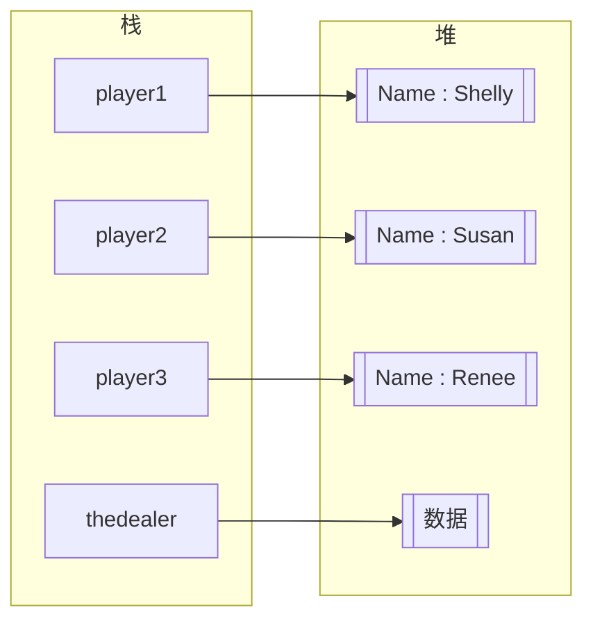

# 1.类的概念和声明

## 1.类的概念
类是一组逻辑上相关联的数据项和函数的封装集合。
它包含数据成员和函数成员：
- 数据成员，存储与该类相关的数据
- 函数成员，存储与该类相关的函数代码

类的数据成员和函数成员

| 数据成员 | 函数成员 |
| ---- | ---- |
| 字段   | 方法   |
| 常量   | 属性   |
|      | 构造函数 |
|      | 析构函数 |
|      | 运算符  |
|      | 索引器  |
|      | 事件   |


一个运行的C#程序是一组相互作用的**类型对象**
类的实例：一个运行的扑克牌游戏程序
我们可以简单的把其中的类分为“Dealer”和“player”
- Dealer类处理与牌局相关的事项
	- 数据成员 纸牌当前的状态、玩家数目等
	- 函数成员 洗牌和发牌等
- Player类表示玩家
	- 数据成员 玩家名称、用于押注的钱等
	- 函数成员 分析玩家手上的牌，出牌，押注等


## 2.类的声明
类在使用前需要进行声明，类的声明创建类实例模板，类的声明提供下列内容:
- 类的名称
- 类的成员
- 类的特征

类的成员没有先后顺序，意味着一个成员的声明完全可以引用另一个在后面的成员。

声明规则:
```C#
class Myclass
{
成员声明
}

class Dealer
{
...
}

class Player
{
。。。
}
```
## 3.类成员

字段和方法是最重要的类成员，字段是数据成员，方法是函数成员

### 1.字段
#### 1. 字段的定义
字段是类内部的变量，**C#不能在类型外部声明全局变量**。

- **字段**变量可以**存储任何类型**，不论是预定义类型还是用户自定义类型，如可以是数值类型，也可以是另一个类。
- 和所有的变量一样，字段可以写入和读取

字段的定义规则:
```C#
{
<type> <name>
}
```


#### 2. 字段的初始化
如变量一样，字段也可以初始化赋值，若不进行初始化，会被编译器设置为默认值。
总的来说：
- 值类型的数据默认值为0
- bool类型的默认值为false
- 引用类型的默认值为null

示例
```c#
classs MyClass
{
int F1;  默认值为0
string F2;  默认值为null，引用类型

int F3 = 25； //初始化为25
string F4 = "abcd"; 

int F1, F3 = 25;
}
```

###  3.方法

#### 1.**方法的定义**
**方法是具有名称的一个代码块**，就如同C中的函数，但C#中没有全局函数，所有方法只是类的一个成员，**同样C#中没有全局方法**。
**方法的调用的执行顺序和返回值**：
- 当代码执行到某个方法时，执行代码调到对应的方法，当方法执行完毕，执行代码返回调用处代码。
- 方法可以返回数据值。

#### 2.**方法的声明**
以一个示例说明
```C#
class SimpleClass
{
void printNums()
{
Console.WriteLine("1");
Console.WriteLine("2");
}
}
```

- **返回类型**,方法的返回类型，不返回值则是void。 如例中的`void`
- **名称**，方法的名字，如例中的`printNums`
- **参数列表**，需要传入方法的参数，没有则用`()`
- **方法体**，具体写方法的执行代码需要用`{}`包裹

## 4.创建变量和类的示实例
类的声明只是创建了一个类实例的模板，在类声明后就可以开始创建类实例：
- 类是引用类型，需要为数据引用和实际数据都申请内存。
- 数据引用保存在一个类类型的变量当中，要创建类实例需要从声明一个类类型变量开始，该变量提供了“实际数据引用“的存储空间

示例：
```
class Dealer
{
..
} // 声明了Dealer类

class Program
{
static void Main()
{
	Dealer theDealer; //创建了一个Dealer类类型的变量，因其是引用类型，则其在栈中
	...
}
}
```

## 5.为数据分配内存
声明类类型变量只是在栈中分配类内存用来保存引用的。
要为类实际数据分配内存，需要使用new运算符。
- **new运算符为任意指定类型的实例分配并初始化内存**，它依据类型不同从栈或堆中分配。
- 使用new运算符组成一个对象创建表达式：new typeName()
	- 关键字new
	- 要分配内存的实例的类型名称
	- （参数），没有则不写
- 如果将类型分配给一个引用类型，则对象创建表达式返回一个引用，指向在堆中被分配并初始化的对象实例。


```C#
class Dealer {..}

class App
{
static void Main()
{
Dealer theDealer; //创建了类类型的变量，分配给栈空间用以存储引用
theDealer = new Dealer();  // new Dealer（）为theDealer分配了堆内存空间，并返回了引用地址
...
}
}
```


以上两步可以合并为：
`Dealer theDealer = new Dealer();`


# 2. 实例成员-类实例的数据成员
**实例成员其实就是类实例的数据成员**，因每个类实例都有自己的独特的数据成员，故也可以称为实例成员。
**静态成员**，我们也可以声明与类相关而不是与类实例相关的数据成员，这样的数据成员被称为静态成员。

实例：
```C#
 class Dealer { ...}
 class Player
 {
     string Name;
    ...
 }
 class Program
 {
     static void Main()
     {
         dealer therdealer = new dealer();
         Player Player1 = new Player();
         Player Player2 = new Player();
         Player Player3 = new Player();

     }
 }
```





# 3.访问修饰符
## 1.什么是访问修饰符
类内部的函数成员，可以通过名称来访问任意类型的其他成员。
通过“访问修饰符”可以来限定该成员被访问的权限。

有5种控制权限：
- 私有的 private；
- 公有的 public；
- 受保护的 protected；
- 内部的 internal；
- 受保护内部的 protected internal；

示例：
```
public string name;
private void func1()
{
...
}
```
## 2.私有访问和公有访问
### 1.私有访问
私有成员**只能从声明它的类内部访问**，其他类看不见或无法访问它。
- 私有访问是默认的访问级别，不带访问修饰符默认是私有访问。
- 也可以使用private 来显示的表示私有访问级别。
```
int Myint1;
private int Myint2;
```

### 2.公有访问
实例的公有成员**可以被程序中的其他对象访问**，必须带有`public`修饰符
`public int Myint`

## 3.从类的内部和外部访问成员
### 1.从内部访问
从类的内部访问，函数成员用成员名称访问即可。
实例：
```C#
using System;

public class DaysTemp
{
	private int High = 75;
	private int Low = 45;

	private int GetHigh()
	{
		return High;  //私有访问字段
	}

	private int GetLow()
	{
		return Low;  //私有访问字段
	}

	public float Average() 
	{
		return (GetHigh() + GetLow()) / 2;  //访问私有方法
	}
}
```
### 2.从外部访问
从外部访问，通过点运算符**类实例变量名称.成员名称**来访问。
示例:
```C#
using System;

class DaysTemp
{
	public int High = 75;  //public修饰符
	public int Low = 45;  //public修饰符

}

class Program
{
	static void Main()
{
	DaysTemp temp = new DaysTemp();

	temp.High = 85; //使用类实例变量名称.成员访问
	temp.Low = 60;

	Console.WriteLine($"High : {temp.High}");
	Console.WriteLine("Low : {0}",temp.Low);

	Console.ReadLine();
}
}
```

