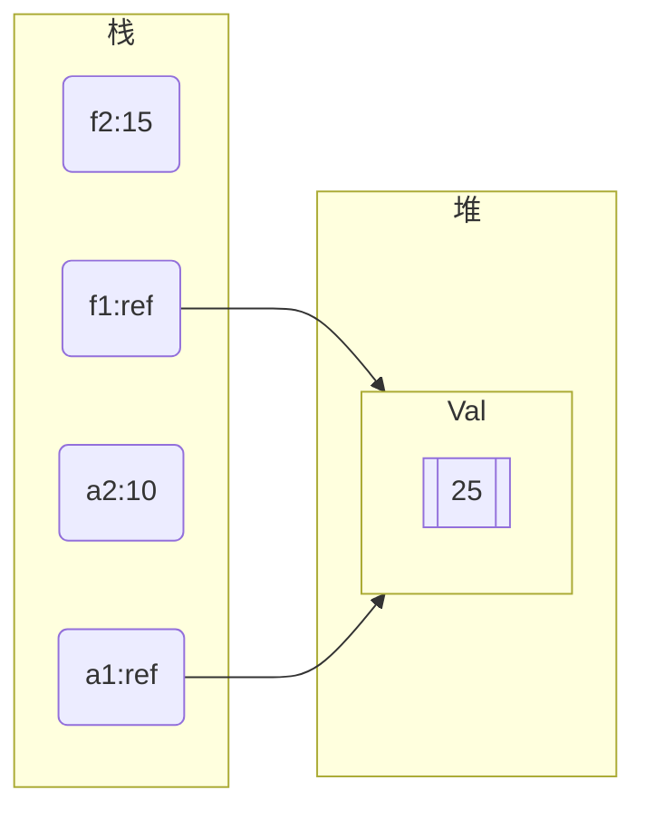
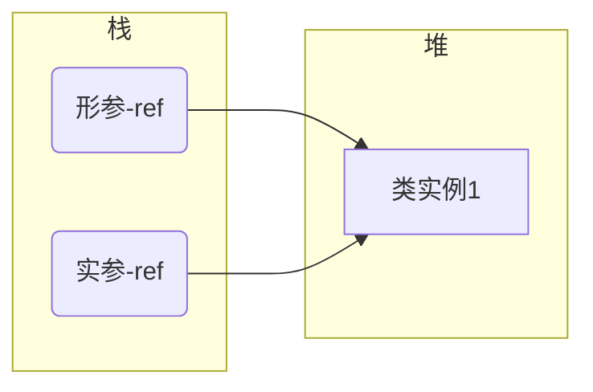
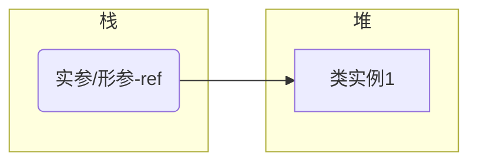
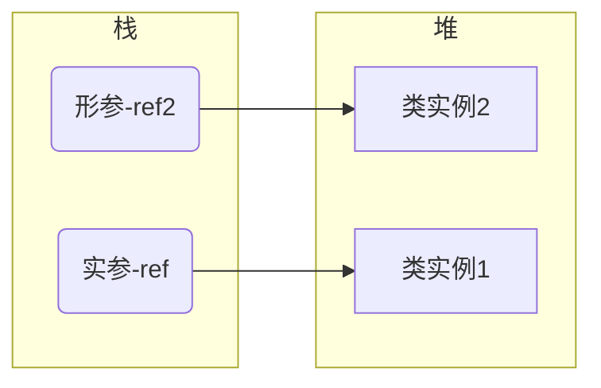
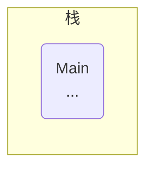
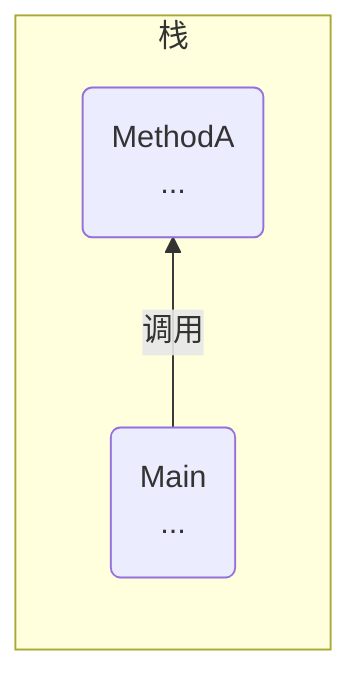
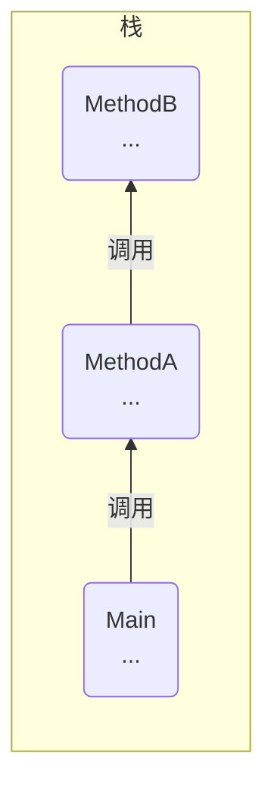

# 1. 方法的结构
方法是类的函数成员，方法本身是一块具有名称的代码。 可以使用方法的名称从别的地方使用方法，也可以把数据传入 方法并得到数据输出。

以一个示例解析方法的结构：
```C#
void DoTask() //方法头
{
 语句1；
 语句2；
 ...
 语句n;
}  //方法体
```

方法头,方法头指定方法的特征，包括：
- 方法是否返回数据，如果返回，返回什么类型; 
	- void不返回
	- 其他类型，返回相应的数据
- 方法的名称；
- （参数）哪种类型的数据可以传递给方法或从方法返回，以及应如何处理这些数据。

方法体，包含可执行代码的语句序列。**执行过程是按顺序进行**。

# 2.方法内部的代码模块分类
用{}括起来的部分都是方法体的部分，可以被称为块。块可以包含以下项目:
- 局部变量
- 内嵌的块
- 控制流结构：条件语句和循环。
- 方法的调用
- 其他方法，又称局部函数。

# 3.局部变量
## 1.什么是局部变量
局部变量是在方法块内部使用的变量，
`<Type> <Name> = Value`
- 局部变量只在方法块内部有效。
- 可以在方法块内部任意位置使用局部变量，但是使用之前需要声明。

对比实例字段和局部变量：

|       | 实例字段                    | 局部变量                                 |
| ----- | ----------------------- | ------------------------------------ |
| 生存期   | 从实例被创建开始，到实例不再被访问结束     | 从他在块中声明的那一块到块完成执行结束                  |
| 隐式初始化 | 初始化成该类型的默认值             | 没有隐式初始化，如果变量在使用之前没有被赋值，会报错           |
| 存储区域  | 实例是类的字段，所以所有类型的字段都存储在堆中 | 数值类型：存储在栈中;<br>引用类型：引用存储在栈中，数据存储在堆中。 |


## 2.类型推断和var关键字
在局部变量的使用当中，**当编译器可以从赋值的数据推断出数据的结构时，我们可以使用var关键字来代替相应的数据类型关键字**，如`Int`;

```C#

static void Main()
{
int total = 15;
MyExcellentClass mec = new MyExcellentClass();
..
}
可以将类型名速记为：
static void Main()
{
var total = 15;
var mec = new MyExcellentClass();
..
}

```


## 3.嵌套块中的局部变量
方法体内部可以嵌套其他的块，块就是用{}包裹起来的代码。
- 方法体内部可以有任意数量的代码块，可以是顺序的或嵌套的。可以嵌套到任意级别。
- 局部变量可以在嵌套块内部声明，**嵌套块内部局部变量只在该嵌套块生命周期内有效**，*当控制流流传出嵌套块时，局部变量从栈中弹出。
- 嵌套块外部的已经声明的局部变量可以在嵌套块内部使用（因为它的生命周期是整个块）
- **块内部的局部变量不能重名**，即使是在嵌套块内部。
```C#
void Method1
{
int var1 = 5;
{ 
	int var2 =10;  //嵌套块内部局部变量
	...
}
..
}
```


# 4.局部常量
局部常量，常量与变量的区别是它一旦被声明就不能改变；

规则：
`const <Type> <Name> = <Value>`

局部常量的规则：
- 局部变量声明后不能改变。
- 局部常量声明时必须初始化。
- 初始化值通常是一个预定义的简单类型，或由其组成的表达式，还可以是null引用，但不能是某对象的引用，因为对象的引用在程序运行时才决定。

```
void Methon2
{
const double PI = 3.1416;

}
```


# 5.局部函数
从C#7.0开始，你能在一个方法中声明中嵌套声明另一个方法，该方法叫做局部函数：
- 局部函数只能在包含他的方法体中使用
- 局部函数可以在任意位置声明，不需要遵循先声明后使用的规则。

示例
```C#
using System;

class Program
{
 
   
    public void MethodWithLocalFunction() 
    {
        int results = MylocalFunction(5); //调用局部函数,先调用后声明都可以
        Console.WriteLine("Results of local function call : {0:d}", results);

        int MylocalFunction(int z1)  //声明局部函数
        {
            return z1 * 5;
        }
    }

    static void Main()
    {
        var myProgram = new Program();
        myProgram.MethodWithLocalFunction(); //调用方法
    }
}
```

# 6.控制流
控制流指的是程序从头到尾的执行流程。默认情况，程序按顺序执行。
控制流语句允许你改变执行顺序：

选择语句：
- if
- if .. else
- switch

迭代语句:
- for循环
- while循环
- do循环
- foreach 为一组中每个成员执行一次

跳转语句：
- break语句
- continue语句
- goto语句
- return语句

# 7.方法调用

可以在方法体内调用其他的方法，使用**方法名和参数列表**。

```C#
using System;

class Myclass
{
    void PrintDateAndTime()
    {
        DateTime dt = DateTime.Now;
        Console.WriteLine($"{dt}");
    }
    static void Main()
    {
        Myclass mc = new Myclass();
        mc.PrintDateAndTime();  //使用实例名和方法名
    }
}
```

# 8.返回语句
## 1.return \<expression\>

方法调用可以在调用后返回一个值：
- 需要调用的方法必须声明返回类型，无返回值的方法必须是void；
- 在方法体中必须有`return <expression>;`返回表达式
- 当控制流到达方法体的关闭大括号时，控制放回到调用代码，并且没有值被插入到调用代码中

示例：
- 可以返回用户自定义类型对象
```C#
Myclass method3()
{
Mycalss mc = new MyClass();
...
return mc;  //返回一个Myclass对象
}
```

- 在语句中调用方法并使用返回值
```C#
using System;
class MyClass
{
    public int GetHour()
    {
        DateTime dt = DateTime.Now;
        int hour = dt.Hour;

        return hour; //返回值
    }

    class Program
    {
        static void Main()
        {
            MyClass mc = new MyClass();
            Console.WriteLine("Hour: {0}", mc.GetHour()); //调用方法
        }
    }
}
```


## 2.void方法 return;
void无返回值的方法中，可以使用`return;`提前退出方法。

```C#
void SomeMethod()
{
...
if ( SomeCondition)
	return; //提前结束方法
...
if ( OtherCondition)
	return; //提前结束方法

...
}
```

# 9.参数
参数可以在方法调用时传入数据给方法。


## 1.实参
实参是将实际的参数传入到方法中，可以看作是形参的初始化。
- 形参在方法定义时使用，实参初始化形参。
- 实参必须与实参的类型对应，否则会报错。
- 实参可以是值，变量和能计算出结果的表达式
	- 对于变量，必须先被复制；对于引用类型，变量可以被设置为一个实际的引用或null。

 位置参数
位置参数形实参与形参的类型和位置需要一一对应；

## 2.形参

形参是方法内部的变量，形参形式上代替实参的位置，被接受实参的传参。
```
public void PrintSum( int a, int y)
{
int sum = a + b;

Console.WriteLine($"Newsflsh: {x} + {y} is {sum}");

}
```

- 形参在方法声明的()中定义，并且**形参是变量**，格式是`type name`
- 多个形参用`,`隔开
- 形参定义后可以像**局部变量**一样在方法体中使用


# 10.参数的类型
## 1.值参数（value parameter）
所谓值参数就是，就是在**使用时将实参的值复制到形参的形式把数据传递给方法**。默认传参方式是值参数
方法在调用时会进行以下操作：
- 系统在栈中为形参分配空间
- 将实参的值赋值给形参

示例：
```C#
using System;

class MyClass
{
    public int Val = 20;
}

class Program
{
    static void MyMethon(MyClass f1, int f2)  //使用类作为形参
    {
        f1.Val = f1.Val + 5;
        f2 = f2 + 5;

        Console.WriteLine($"f1.val: {f1.Val}, f2 : {f2}");

   }

   static void Main()
    {
        MyClass a1 = new MyClass(); //实例化类
        int a2 = 10;

        MyMethon(a1, a2);
        Console.WriteLine($"a1.val: {a1.Val}, a2 : {a2}"); 
    }
}

f1.val: 25, f2 : 15
a1.val: 25, a2 : 10
```

分析以上代码：

方法开始时


方法结束

- 方法调用之前，a1和a2已经存储好：
	- a2是数值类型，值直接放在栈中 `a2 = 10`
	- a1是引用类型，是Myclas的实例，引用部分放在栈中，数据部分放在堆中，也即`Val = 20`
- 调用传参时，方法会给参数创建存储空间
	- a1是引用实例，直接将引用部分复制给f1即ref，都指向堆中的数据
	- a2是数值类型，直接复制数值10到f2存储空间即可
- 在方法进行中，对f1和f2进行数据处理操作
	- f2是复制的值，与a2无关，故结束后a2的值不会改变
	- a1是引用值，a1 f1的引用都相同，故结束后f1的值会变化

总结：就如同C的指针，引用类型参数在方法传参后会对原本的值有影响。

## 2.引用参数
引用参数就是在传参时，给定变量实参，形参名指定为实参变量名的别名。即形参名和实参名指向相同的内存地址。
- 实参必须是变量形式，引用类型必须要赋一个引用值或赋null
- 形参名作为实参变量的别名，在方法内部操作形参时对应实参值也会改变。
- 使用引用参数时必须在方法声明调用都在形参前添加ref `Methon( ref int a_num)`
- 在方法调用时，使用**引用参数系统不会在内存为其分配空间**，只是引用别名、

```C#
using System;

class MyClass
{
    public int Val = 20;
}

class Program
{
    static void MyMethon(ref MyClass f1, ref int f2)
    {
        f1.Val = f1.Val + 5;
        f2 = f2 + 5;

        Console.WriteLine($"f1.val: {f1.Val}, f2 : {f2}");

    }

    static void Main()
    {
        MyClass a1 = new MyClass();
        int a2 = 10;

        MyMethon(ref a1,ref a2);
        Console.WriteLine($"a1.val: {a1.Val}, a2 : {a2}");
    }
}
f1.val: 25, f2 : 15
a1.val: 25, a2 : 15
```

与值参数不同的是，
此时a2的值也会被改变，因为形参名是实参变量名的别名，操作形参就是操作实参的内存数据。
a1的结果与之前一致，因为同样是引用，只是这次没有分配新的内存空间存储。

此时，在传参后：
a1,f1 --> Ref -- Val
a2,f2 --> 10


## 3. 引用类型实参传参给值参数和引用参数的区别

### 1.根本区别
引用类型实参传参给值参数和引用参数的主要区别是：
- 传递给值参数时，系统会在栈中给形参分配一块存储引用的空间，此时栈中有两块存储引用的空间。
- 传递给引用参数时，系统只是把形参名作为实参的别名，只有一块存储引用的空间。

**形式参数传给值参数，本质有两个引用指向同一个堆数据。**



**形式参数传给引用参数，本质上实参和形参是一个变量。**



### 2.在方法内对形参设置会造成不同

**在方法内部修改它的成员时，这两种方式不会有所不同。只是修改类实例的字段，不会新增类实例**


**但当在方法内部设置形参本身时，就会导致形参的引用指向新的实例：**
- 当形参是值参数时，假设新参是一个类实例，当在方法内部赋给形参一个新的实例，此时外部的实参和内部的形参就会断开连接。


当我们使用值参数时，栈和堆中参数的指向


当我们在方法中给形参新分配新类实例时， 形参栈中的ref指向新类实例的存储位置



## 4.输出参数
输出参数，用于从方法体内把数据传出到调用代码。
- 输出参数是引用参数，使用`out 修饰符`
- 函数体中的实参必须是变量，方便给其分配内存，因为输出参数是引用参数不会有自己的内存空间。
- 在方法体内部给输出参数赋值后我们才能读取它，故在给输出参数赋提前赋值是没有意义也没必要的。
- 在方法体内不，在每个分支结束之前都必须给所有输出参数赋值。


示例
```C#
public void Add2( out int outValue)
{
int var1 = outValue + 2; //错误，不能在方法赋值之前读取输出参数

}


using System;

class MyClass
{
    public int Val = 20;
}

class Program
{

    static void MyMethod(out MyClass f1, out int f2)
    {
        f1 = new MyClass();
        f1.Val = 25;  //先赋值才能在后面使用输出参数
        f2 = 25;
    }

    static void Main()
    {
        MyClass a1;   
        int a2;

        MyMethod(out a1, out a2);  

        Console.WriteLine("a1.val = {0}; a2 = {1}", a1.Val, a2); //可以在调用结束后继续使用a1和a2


    }
```

- 在C# 7.0中可以只在方法调用时声明输出参数变量
`MyMethod(out Myclass a1, out int a2);`


## 5. 参数数组
### 1.参数数组的定义和使用
默认的位置参数，形参必须严格对应实参。 参数数组则不同，他允许特定类型的零个或多个实参对应一个特定的形参。
- 在一个参数列表中只能有一个参数数组。
- 如果有，它必须是列表中的最后一个。
- 有参数数组表示的所有参数必须是同一类型。

声明一个参数数组需要：
- 在数据类型前使用params修饰符
- 使用数据类型type\[\]表示这是一个数组
- params修饰符只需要在方法声明时使用，在调用方法时不需要使用。

示例：
`void ListInts(params int[] inVals)` 

### 2.如何在方法中使用参数数组

#### 1.延伸式
`ListInts( 10, 20, 30);`
如上，延伸式可以在传参时直接列出数组的参数。

并且可以不定的传入0个或多个参数,如下示例：
```C#
void ListInts( params int[] inVals)
{ }

...
以下时一些多个参数传递示例：
ListInts(); //0个实参
ListInts(1, 2, 3); //3个实参
ListInts(4, 5, 6, 7); //4个实参
```
此时，编译器：
- 接受实参列表，用他们在堆中创建并初始化一个数组。
- 把数组的引用保存到栈中的形参里。
- 如果在对应形参数组的位置没有实参，编译器会创建一个有零个元素的数组来使用。

当数组的参数是值类型，值被直接复制。
当数组的参数是引用类型， 引用被复制，实参引用的对象在方法中会受影响。

一个使用延伸式参数数组的示例：
```C#
using System;

class MyClass
{
    public void ListInts(params int[] inVals)
    {
        if ((inVals != null) && (inVals.Length != 0))
            for( int i = 0; i < inVals.length; i++)
            {
                inVals[i] = inVals[i] * 10;
                Console.WriteLine($"{inVals[i]}");
            }
    }
}

class Program
{
    static void Main()
    {
        int first = 5, second = 6, third = 7;  

        MyClass mc = new MyClass();
        mc.ListInts(first, second, third); //在这里将所有延伸式参数用于初始化堆中的数组，并将数组的引用被赋值给形参inVals.

        Console.WriteLine($"{first}, {second}, {third}");
    }

}

```
#### 2.数组实参
将数组作为一个实参传递给方法。
```C#

static void Main()
{
int[] myArr = new int[] {5, 6, 7};
MyClass mc = new MyClass();
mc.ListInts(myArr);

foreach (int x in myArr)
	Console.WrireLine($"{x}");
}


```


## 6. 参数类型总结


| 参数类型 | 修饰符    | 是否在声明是使用 | 是否在调用时使用 | 执行                 |
| ---- | ------ | -------- | -------- | ------------------ |
| 值    | 物无     |          |          | 系统把实参复制到形参，都有内存空间  |
| 引用   | ref    | 是        | 是        | 形参是实参的别名           |
| 输出   | out    | 是        | 是        | 仅包含一个返回的值。形参是实参的别名 |
| 数组   | params | 是        | 否        | 允许传递可变多个数目的参数到方法   |


# 11.实参与形参的对应方式

## 1.位置参数
默认参数对应的方式是位置参数，就是实参与形参的位置一一对应。

## 2.命名参数
在调用方法时，显式的指定参数的名字，即`形参名 : 实参值`
`c.Calc ( c : 2, a : 4, b : 3);`
示例：
```C#
class MyClass
{
public int Calc(int a, int b, int c)
{return (a + b) * c;
}

static void Main()
{
Myclass mc = new MyClass();
int result = mc.Calc( c : 2, a : 4, b : 3);
Console.WriteLine("{0}", result);
}
}
```

在调用时可以同时使用位置参数和命名参数，所有位置参数必须先列出：

```C#

public int Calc( int a, int b, int c ) { return (a + b) * c;}


mc.Calc( 4, 3, 2);
mc.Calc(4, b : 3, c :2);  //先将位置参数列出
mc.Calc(4, c : 2, b : 3);
mc.Calc(c : 2, b : 3, a : 4);
mc.Calc(c : 2, b : 1 + 2, a : 3 + 1);
```

## 3.可选参数

在方法调用时允许忽略部分参数，不通过实参传参，方法是为参数赋默认值。
```C#
class Myclass
{
public int Calc( int a, int b = 3) //b为可选参数，有默认值
{ return a + b};
}

static void Main()
{
MyClass mc = new MyClass();

int r0 = mc.Calc( 5, 6);
int r1 = mc.Calc(5); //此时使用形参b的默认值
}
```

**可选参数的规则：**

- 允许作为可选参数的参数类型：

|      | 值             | ref | out | params |
| ---- | ------------- | --- | --- | ------ |
| 值类型  | 是             | 否   | 否   | 否      |
| 引用类型 | 只允许null作为默认类值 | 否   | 否   | 否      |

- **所有必选参数必须在可选参数前，所有params必须在可选参数后**
如示例，必须参数值在前，数组参数在后
`(int x, decimal y .... int op1 = 17, double op2 = 36, ... params int[] intVals)`

- 可选参数不能任意位置省略，必须从最尾的可选参数开始省略到前面n个，不能指定位置省略，则会导致参数不明
```C#
public int Cals( int a = 2, int b = 3, int c = 4 );


int ro = mc.Calc(5, 6, 7);
int r1 = mc.Calc(5, 6);
int r2 = mc.Calc(5);
int r3 = mc.Calc();

如上，从最后开始逐步往前开始省略。
```

- 当必须要在中间某个位置省略时可以结合命名参数和可选参数的特性
```C#
public double GetCylinderVolume(double radius = 3.0, double height = 4.0)
{
return 3.1416 * radius * height;
}

static void Main()
{
mc.GetCylinderVolume(3.0, 4.0);
mc.GetCylinderVolume(radius : 2.0);
mc.GetCylinderVolume(height : 2.0);
mc.GetCylinderVolume();  

}
```

# 12.ref局部变量和ref返回

## 1.ref局部变量
ref局部变量允许为一个变量创建一个别名变量，他们本质上是一个变量。值类型的变量也支持ref局部变量。

ref局部变量的公式

`ref type name = ref name` 左边是声明别名变量，右边是已存在的变量
示例：
`ref int y = ref x;` 此时y就是x的别名变量


## 2.ref返回方法
ref返回方法提供了一种返回变量引用的方法到方法外，可以在方法外修改方法中的变量值。

规则：

public **ref** type MethodName()
{

return  **ref**  VarName;
}

需要在方法声明时和return 语句都带上ref。

ref返回方法的额外限制：
- 不能将返回类型是void 的方法声明为ref方法；
- ref return 不能返回以下内容
	- 空值
	- 常量
	- 枚举成员
	- 类或者结构体的属性
	- 指向只读位置的指针

- ref return 表达式只能指向原先就在调用域内的位置或字段。所以它**不能指向方法的局部变量**。 如果指向局部变量，方法调用完成后局部变量就会被销毁，导致悬空指针问题，即指针指向一个销毁的值。
- ref局部变量**只能被赋值一次**。一旦赋值就不能在指向其他位置。
- 将一个方法声明为ref返回方法，但是在调用是**省略了ref关键字，则返回的是值而不是引用。**
- 如果将**ref局部变量作为常规实参传递给其他方法，方法获取的是变量值而不是引用。**

示例
```C#
using System;

class Simple
{
    private int score = 5;

    public ref int RefToValue()  //在方法名和return中都使用
    {
        return ref score;

    }

    public void Display()
    {
        Console.WriteLine($"Value inside clas object : {score}");

    }
}

class Program
{
    static void Main()
    {
        Simple s = new Simple();
        s.Display();

        ref int v1Outside = ref s.RefToValue(); //通过ref局部变量别名，让我们可以访问局部方法内的局部变量

        v1Outside = 10;  //修改ref变量
        s.Display();
    }
}

```

Math库Max方法变形，可以返回较大值，并加以修改
```C#
using static System.Console;

class Program
{
static ref int Max(ref int p1, ref int p2)
{
if (p1 > p2)
	return ref p1;
else 
	return ref p2;
}

static void Main()
{
...
ref int max = ref Max(ref v1, ref v2);
..

max++; //此时我们修改了p1,p2中的最大值的数值


}

}

```

# 13.方法重载
在类中我们可以通过方法重载的方式，保留相同的方法名，传入不同的参数：
在方法重载时必须有不同的签名：
签名包括：
- 方法名
- 修饰符
- 参数的类型、数量和顺序


返回类型和形参名不是方法的签名

其实**方法重载的关键是要有参数，参数的类型，数量，顺序必须有一不同；**


```C#
long AddValues(int a , out b) {...}

方法的重载
Class A
{
long AddValues( int a, int b)  {return a + b;}  //参数的类型不同
long AddValues(int c, int d, int e) {return c + d + e;}  //参数的数量不同
long AddValues(float f, float g) {return (long)(f + g);}  //参数的类型不同
long AddValues(long h, long m)  { return h + m;}  //参数的类型不同

int AddValues(long c, long d) {return c + d;} //签名相同
 
}
```


# 14.栈帧
 局部变量和参数是位于栈上。
 在调用方法时，会从栈顶部开始分配一块内存空间，保存方法相关联的一些数据项，及一个**栈帧**，用于存储：
 - 返回地址，即方法调用完成后控制流继续执行的位置
 - 分配内存的参数即值参数，还可能是参数数组
 - 与方法相关的其他数据项


在方法**调用时从栈最顶部压入栈帧**，当**方法调用结束后栈帧从栈顶部弹出也叫栈展开**。

通过下面的方法调用说明这个概念：
```C#
class Program
{
static void MethodA(int par1, int par2)
{
Console.WriteLines($"Enter MethodA: {par1},{par2}");
MethodB(11,18);
Console.WriteLine("Exit MethodA");
}

static void MethodB(int par1, int par2)
{
Console.WriteLine($"Enter MethodB: {par1}, {par2}");
Console.WriteLine("Exit MethodB");
}

static void Main()
{
Console.WriteLine("Enter Main");
MethodA(15,30);
Console.WriteLine("Exit Main");
}
}
```

调用方法时，栈帧压入的过程


开始执行Main


Main调用MethodA


Main调用MethodA，MethodA调用MethodB


从栈弹出MethodB


从栈弹出MethodA


# 14 递归

当方法调用自身时，就叫做递归。

一个阶乘的示例,尾递归:
```C#
int Factorial(int inValue)
{
if (inValue <= 1)
 return inValue;

else 
return inValue * Factorial(inValue - 1);
}
```


调用方法自身的机制和调用其他方法其实完全一致，都是为每一次方法调用把新的栈帧压入栈顶，随着递归越来越深栈也越来越大。
