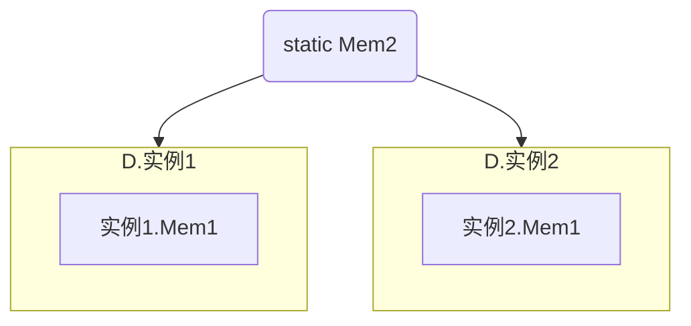
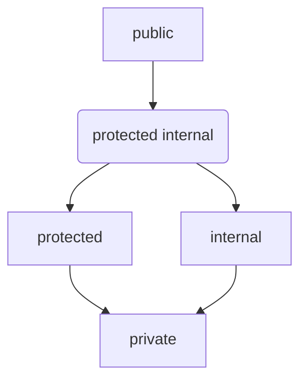

# 1.类成员修饰符的使用规则

`[特性] [修饰符] 核心声明`

修饰符：
- 修饰符在核心声明前
- 修饰符之间可以任意顺序

特性：
- 特性在修饰符之前
- 特性之间可以任意顺序


之前和本章会讲的修饰符

|        | 特性  | 修饰符                                  | 核心声明                     |
| ------ | --- | ------------------------------------ | ------------------------ |
| 字段     |     | public<br>private<br>static<br>const | type name；               |
| 方法<br> |     | public<br>privatest<br>static        | returntype name ( ){...} |


# 2.实例类成员

类成员可以关联到整个类，也可以只关联到类的一个实例。
每个类实例的成员都相当于类成员的副本，我们把这些成员成为**实例成员**。

```C#
class D
{
 public int num;
}

static void Main()
{
D d1 = new D();
D d2 = new D();

d1.num = 10;
d2.num = 20;  //以上两个字段都是实例成员
}
```

# 3.静态类成员

## 1.静态字段
实例字段在每一实例中有不同副本。
**静态字段**，将所有类实例的该字段都关联到同一处内存，当在一个实例中该字段值被改变，所有其他实例中的该值都会被改变。

格式：
`static type name;`

```C#

class D
{
int Mem1;
static int Mem2;
...
}

类的静态成员和实例成员分开保存，
静态成员所有类实例中共享。
```


静态成员单独存储
实例成员，存储在实例中

## 2.静态函数成员

- 静态函数成员独立与所有实例，即时没有类的实例也可以使用静态函数。
- **静态函数只能访问其他静态成员，不能访问实例成员。**

`static ReturnType MethodName()`

```
Class X
{
static int num;
static public void Print();

}

class Program
{
static void Main()
{

X.num = 10;  //没有类实例也可以访问静态类成员
x.Print();   
}
}
```

## 3.从类的外部访问静态类成员

有两种方法可以访问：
-  使用`classname.staticname`类名.静态成员名来访问方法
- 在程序开头使用 using static namespace.class; 可以仅通过使用名字来使用静态成员。

```C#
using System.Console;
using System.Math;


在后面可以使用

WriteLine($""); 省略类Console的方法来使用。
```


## 4.静态成员的生命周期

类其他成员的生命周期会与其类实例绑定，而静态成员的生命周期仅与类相关。

所以即使一个类没有创建实例也可以使用它的静态成员。


示例：

```C#

class D
{

static public int num = 5;

}

class Program
{

static void Main()
{

class.num = 6;   //即使类D没有实例也可以访问静态成员
}
}
```

# 4.常量成员

## 1.成员常量

成员常量与局部常量类似，只是成员常量声明在类中，实际就是声明一个只读的字段。
成员常量在声明中必须赋值，简单值或简单值形成的表达式。
初始化后不能再进行赋值。
```C#
class D
{

const int num = 5;
}
```

## 2.成员常量的全实例可见性

与静态成员一样，成员常量也可以在不声明实例的情况下使用，他在类的每个实例中都是可见的。

他的实现方式是**在程序运行时被编译器替换**，类似C中的`#define` ，故成员常量是没有分配内存的

**常量与静态修饰符是互斥的，不能将常量添加静态修饰符。**

```C#
Classs D
{
const int num = 5;
}

class Program
{
static void Main()
{
Console.WriteLine($"{num}");  //可以直接被使用
}
}
```


# 5.属性

## 1.属性的规则
属性是类中的函数成员，它的基本作用是对一个字段进行读取，返回，并可以在set和get方法中加入逻辑代码以做其他操作。
![[学习/Csharp/图库/属性|属性]]
对于一个属性
```C#
public class Person
{
    private int age;

    public int Age
    {
	    set { age = value; } // value 是外部賦予的值，例如 25
        get { return age; }
        
    }
}

Person person1 = new Person();
person1.Age = 25;  //隐式调用set，此时将25赋给value
int z = person1.Age; //隐式调用get，此时通过get的return语句返回

```


属性的格式

```C#

修饰符 属性类型 属性名
{

set 
{
 = value
}

get
{
return  ;
}

}
```

属性必须只有一对方法，set和get，也叫set、get访问器
- 属性类型与字段类型一致
- set 是数据传入方法
	- set有隐含值参数 value，类型与属性类型一致，当在外部设置属性时即设置的是value的值
	- set返回类型为void
- get是数据返回方法
	- get 必须带有return 语句，**返回属性类型的值**，当外部读取属性时即读取的是return的值。
	- get没有参数
- 可以在get和set方法中增加一些用于处理数据的代码

**属性不一定为数据存储分配内存**

## 2.属性与字段关联的约定

当属性与对应字段关联时: 
- 字段使用private修饰符
- 属性使用public修饰符
- 字段和属性名字相同，但：
	- 字段使用Camel大小写风格或_Camel风格，
		- Camel风格即除第一个单词小写外其余单词首个字母都大写：`someTestName`
		- \_Camel风格即在Camel风格基础上使用\_作为名字开头: `_someTestName`
	- 属性使用Pascal风格，即所有单词首字母都大写 `SomeTestName`


此时关联的字段被称为**后备字段**或**后备存储**。

```C#
using System;

class D
    {
    private int _theRealValue = 5;  //后备字段

    public int TheRealValue
    {
        set
        {
            _theRealValue = value;
        }

        get
        {
            return _theRealValue;
        }
    }

    }

class Program
{
    static void Main()
    {
        D d1 = new D();
        Console.WriteLine("TheRealValue : {0}", d1.TheRealValue); //读取set返回值

        d1.TheRealValue = 10; //set隐式使用，给value设置值

        Console.WriteLine($"_theRealValue : {d1.TheRealValue}");  //隐式使用set，获取_theRealValue值


    }
}

TheRealValue : 5
_theRealValue : 10

```


**属性执行其他字段处理运算的示例**：

属性访问器唯一必须得是 get方法中的return 语句，
那么就可以如下方法使用：

```C#
public int Useless
{
set {}
get {return 5;}
}

//此时属性Useless什么也不做只是返回了5；
```

也可以在属性中设置一些逻辑代码，修改字段的值

```C#
prtivate int _theValue
public int TheValue
{
set { _theValue = value > 100 ? 100 : value; }
get { return TheValue;}
}
```


## 3.只读和只写属性

属性的get和set方法可以只定义一个,但必须至少有一个：
- 当忽略set方法，则就是只读属性，只读属性仅将私有字段处理后传递除去，不能再为字段赋值
	```C#
	class C
	{
	private int _theValue = 5;
	public int TheValue
	{
	get { return _theValue;} //仅将字段传递初上
	}
	}
```
- 当忽略get方法，则是只写属性，只能写操作，只写属性很少见，因为他们基本没有什么实际作用。 如果想在赋值时触发一些副作用，应该使用方法。
```C#
	class C
	{
	private int _theValue = 5;
	public int TheValue
	{
	set {  _theValue = value ;
	Console.WriteLine($"_theValue : {value}")} //在为属性赋值时能有一些副作用
	}
	}
```


## 4.使用属性和使用公有字段的对比

- 属性是函数成员，允许你处理输入输出，公有字段不行。
- 属性可以只读或只写，公有字段不行。
- 编译后的变量和编译后的属性语义不同。
	- 一个例子，当有其他代码引用这个程序集，如果开发员一开始使用公有字段然后在需要增加处理逻辑时改为属性，这会导致其他引用这个程序集的代码也需要重新编译，因为属性和公有字段编译后的语义不同。
	- 而使用属性则只需更改属性中的实现发放即可


## 5. 属性处理非字段示例

属性除了处理字段之外，也可以单纯作为函数成员使用。

示例:

```c#
clas RightTriangle
{
public double A = 3;
public double B = 4;
public Double Hypotenuse
{
get { return Math.Sqrt((A * A) + (B * B));}
}
}

使用只读属性来通过逻辑代码获取返回值。
```


## 6.自动实现属性
属性经常关联到后备字段，所以C#提供了自动实现属性，可以实现不声明后备字段直接使用属性。
在声明时,
- 声明，只使用`set;get;`方法体
- 使用时使用属性名即可
- 系统会创建隐藏字段

```C#
public int TheValue
{
get;set;
}

```
或者也可以使用只读属性：
```C#
public int TheValue
{
get;
}
```

## 7.静态属性

static 修饰符修饰属性：
- 与其他静态函数类型一样，其他属性只能访问其他静态类型，不能访问实例成员但能被实例成员访问。
- 静态成员的存在不依靠实例。
- 在类的内部可以通过名字访问。
- 在类的外部
	-  可以使用类.属性名的方法访问
	- 或实用 `using static 类.属性`  的方式 直接使用属性名访问

示例
```C#
using ConsoleTestApp;
using System;
using static ConsoleTestApp.Trivial;

namespace ConsoleTestApp
{
	class Trivial
	{
		public static int MyValue { set; get; }

		public void PrintValue()
		{
			Console.WriteLine("Value from inside: {0}", MyValue);
		}
	}
}
class program
{
	static void Main()
	{
		Console.WriteLine("Init Value: {0}", Trivial.MyValue); //从外部访问

		Trivial.MyValue = 10;
        
		Console.WriteLine("Init Value: {0}", Trivial.MyValue);

		MyValue = 20; //因为使用了using static可以直接使用名字访问

		Console.WriteLine($"New Value : {MyValue}");

		Trivial tr = new Trivial();

		tr.PrintValue();

    }
}


Init Value: 0  //隐藏字段初始化默认值为0
Init Value: 10
New Value : 20
Value from inside: 20
```

# 6.实例构造函数

## 1.构造函数语法

实例构造函数是一种特殊的方法，它在每次创建类实例时使用，它可以初始化类实例的成员。并且可以使用重载构造函数的方法选择不同的构造函数进行初始化。

构造函数语法：

```C#
Class ClassName
{

type 字段1 ;
type 字段2 ;

public ClassName(参数,参数)
{
字段1 = 参数1；
字段2  = 参数2；
}
}
```

- **构造函数的名称必须与类名相同；**
- **如果希望能从类外部创建类实例，需要将构造函数声明为public.**
- **构造函数可以带参数也可以不带参数，根据实际使用。**
- **构造函数不能有返回值。**

## 2.使用构造函数参数和重载初始化函数

可以通过重载和带参数的构造函数为实例初始化不同的成员值。

示例:
```C#
using System;

class Class1
{
    int id;
    string Name;

    public Class1() { id = 10; Name = "Bob"; } //构造函数0
    public Class1(int val) { id = val; Name = "Bob"; } //构造函数1
    public Class1(string name) { Name = name; } //构造函数2

    public void SoundOff()
    {
        Console.WriteLine($"Name : {Name}, id : {id}");
    }

}

class Program
{
    static void Main()
    {
        Class1 a = new Class1();  //使用构造函数0初始化
        Class1 b = new Class1(25);  //使用构造函数1初始化
        Class1 c = new Class1("Peter");  //使用构造函数2初始化

        a.SoundOff();  
        b.SoundOff();
        c.SoundOff();
    }
}

Name : Bob, id : 10
Name : Bob, id : 25
Name : Peter, id : 0
```

## 3.默认构造函数
在类中没有显式的声明构造函数，那么编译器为提供一个隐式的默认构造函数。
隐式构造函数，没有参数，方法体为空

```C#
public class() {}
```
所有在类外面创建新类时 class 实例名 = new class(); 后面是构造函数。


## 4.静态构造函数

静态构造函数如同其他静态函数，只能访问静态成员。
具体的来说静态构造函数就是初始化静态成员的。

静态构造函数的语法：

```C#

private static Random Randomkey;

static ClassName()
{
RandomKey = new Random();
}


```
- 静态构造函数不能有参数。
- 静态构造函数不能有访问修饰符。
- 一个类中只能有一个静态构造函数，此外静态构造函数不能显式使用，而是在任何实例创建之间系统自动调用他们。


# 7.对象初始化语句

  利用对象初始化语句可以为对象的实例成员初始化。对象初始化语句有以下特点：
- 对象初始化语句只能初始化可以访问到的成员，比如public成员。
- 对象初始话语句在构造函数之后，故其可以在构造函数的基础上进行修改。构造函数是成员值的预制，初始化语句是对成员的初始化。


初始化语句的语法：
```C#
1. new TypeName { 成员1 = Value1, 成员2 = value2 .. 成员n = valuen};  //无参数的构造函数不适用参数列表的()
2. new TypeName(参数)  {成员1 = Value1, 成员2 = value2 .. 成员n = valuen};
```

示例：
```C#
public class point
{
int X = 5；
int y = 6；
}

class Program
{
static void Main()
{
point c1 = new point();
point c2 = new point { x = 1, y = 2};
Console.WriteLine($"pt1 : {0}, {1}",pt1.x, pt1.y);
Console.WriteLine($"pt2 : {0}, {1}",pt2.x, pt2.y);
}
}

pt1 : 5, 6
pt2 : 1, 2
```

# 8. readonly修饰符
readonly修饰符类似于const修饰符，可以使字段只读，区别是
- const修饰符只能在字段声明时就确定赋值，const成员没有分配内存而是由编译器替换
- readonly修饰符可以在以下两个地方赋值
	- 在类中声明时 readonly int x = 5；
	- 可以在不同重载构造函数中赋不同的值，具体在声明时不赋值，而在构造函数中赋值
- readonly修饰符可以是实例字段也可以是静态字段
- readonly修饰符可以在内存中由储存位置

示例：
```C#
class shape
{
readonly double PI = 3.1416;  //初始化时赋值
readonly int NumberOfSide;  //初始化时不赋值

public shape(douvle side1, double side2)
{
NumberOfSide = 4; //在构造函数中初始化
...
}

public shape(double side1, double side2, double side3)
{
NumberOfSide = 3;
...
}

}
```


# 9.this关键字

this关键字是在类中使用，是生成实例后它代替类实例名。

this关键字是在类中对类实例名的占位，主要用于以下目的:
- 类成员与局部变量，局部方法区分
- 作为调用方法的参数

能在以下成员中使用：
- 实例构造函数
- 实例方法
- 属性和索引器的实例访问。

**因为this关键字是实例名的占位，说以this关键字不能用在静态函数成员。**

```C#
class MyClass
{
int Var1 = 10;
pub int ReturnMaxSum(int Var1)
{
return var1 > this.Var1 ? var1 : this.Var1;  //This类实例中代替具体的类实例名称
}

class Program
{
static void Main()
{
MyClass mc = new MyClass();

Console.WriteLine($"Max : {mc.ReturnMaxSum(30)}");
Console.WriteLine($"Max : {mc.ReturnMaxSum(5)}");
}
```

# 10.索引器 indexer

## 1.索引器的使用方法

索引器与属性一样也是一组`get;set;`方法，也是对字段的处理。
与属性不同的是：
- 属性只能处理一个字段，而索引器可以通过索引处理多个字段。
- 索引器是处理类实例的成员，所以它**不能处理静态成员**，即他不能使用static修饰符。
与属性相同的是：
- 索引也是只读索引或只写索引，即只使用get；或set;
- 索引与属性一样也不需要内存空间存储
- 索引也属性一样也可以不关联任何字段。

索引器的语法：

```C#
public returnType this [ type param1,...]
{
set { value; }
get {return  ;}
}
```

- 必须使用**public**方法，因为我们要在外部使用它
- 索引器的类型**type**是对应字段的类型。
- **this** 使用this而不是名称，索引器没有名称
- \[] 索引运算符 ， 与.点运算符区分
- \[] 中要声明索引器索引的类型，以及参数，参数列表中至少要有1个参数
- set { } 
	- 与属性一致，有隐形参数value，value类型与索引器一致，无返回值
	- set的参数列表与索引器一致
```C#
void set (  typeparam1...，type value )
{

}
```
- get{}
	- 与属性一致，有返回值，返回值为索引器类型也即字段类型
	- 无参数

```C#
type get ()
{return ...;}
```


示例：

## 2.索引器重载

因为索引器的名字都是this，所以可以通过索引器重载来在一个类中使用多个索引器。

重载的关键就是，签名不同，具体到索引器，就是参数的类型，顺序和数目不同。


示例：
```C#
class Myclass
{

public string this [int index]
{
get{...}
set{...}
}

public string this [ int index1, int index2]
{
get{...}
set{...}
}

public int this [float index]
{
get{...}
set{...}
}

}
```

# 11.set,get访问器的修饰符

属性和索引器都有访问器set和get。 我们可以给访问器设置修饰符，但有以下的要求：
- 要设置修饰符时，必须同时有get和set，且只能设置一个访问器的修饰符
- 访问器的修饰符必须比成员的级别更严格



示例：
```C#
class Person
{ 
public string Name {get; privare set;}  //这里只允许读取，不能在外部写入
public Person(string Name) {Name = string;}  //通过使用构造函数的方式写入
}

class Program
{
static void Main()
{
Person p = new person("Capt. Ernest Evans");
Console.WriteLines($"Person's name is {p.name}");
}
}
```

# 12.分部类和分部方法

## 1.分部类
分部类就是将一个类拆成多块来声明，这样有利于代码的逻辑分割，方便代码的管理和维护。
分部类可以在同一文件也可以在不同文件，在使用时编译器会将其整合。

使用时，使用partial class标识符来表示这是分部类。
partial不是关键字只是一个标识符，只在与class一起用时才生效。

示例：

```C#
public partial class User
{
public string Nmae {get; set;}
public int Age { get; set;}   //user的个人信息

public void UpdateProfile()
{
}
}

public partial class User
{
public string Role {get; set;} //user的权限信息
public void UpdateProfile()
{
}
}
}
```


## 2.分部方法

分部方法配合分部类使用，可以将方法的声明和方法的实现放在两个partial 分部类中使用。
同样可以提高代码的逻辑性，让第一个partial都是逻辑部分，第二个partial都是实现部分。

分部方法使用时：
- 不能有修饰符，所以分部方法都是private方法
- 不能有返回值，返回都是void
- 不能使用out参数，因为都是private方法


语法：

```C#
partial class class1
{
partial void MethodName(type params);  // 声明部分，要使用;结尾
}


partial class class1
{
partial void MethodName(type params)
{
expression;
...
}

}
```

- partial 方法声明部分必须有完整的方法头且以`;`结尾
- partal 方法实现部分要写出完整的方法头方法体。
- 声明部分和实现部分都要使用partial来标识。

如果只有声明部分，则编译器会自动移除方法声明和方法调用。