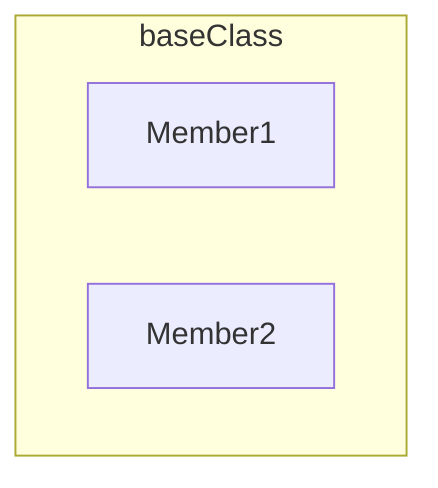
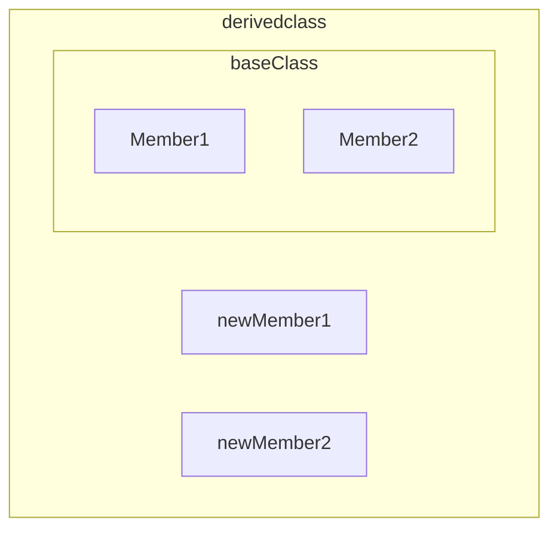
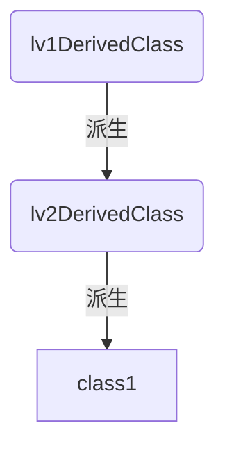
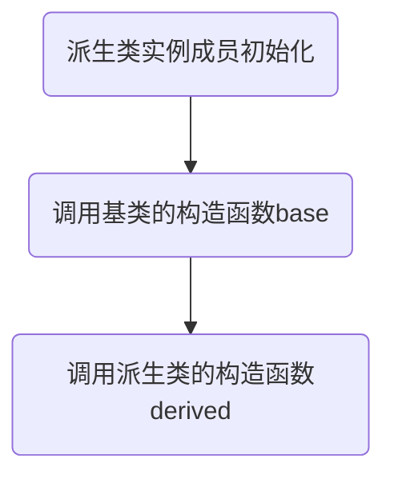
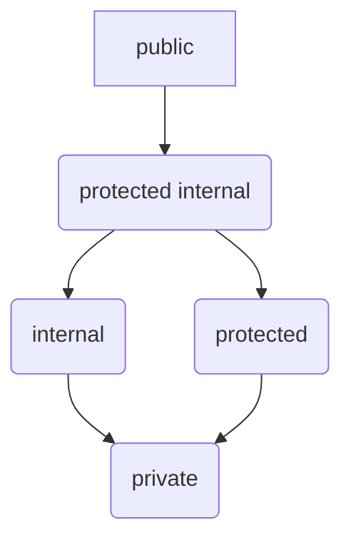

# 1.类继承

## 1.类继承基础规则
类可以通过继承拓展一个已存在的类，这个原来的类叫做**基类(base class)**，而继承的新类叫**派生类(derived class)**

语法：
```C#
class newClass : baseClassName
{
...
}
```

- 派生类要在声明后进行基类规格说明 使用 : baseName 表示
- 派生类中自动会包含基类的成员，在派生类中声明新派生类的成员即可







## 2.访问继承的成员
派生类自己像使用自己的成员一样访问它们
示例:
```C#
using System;

class aBaseClass
{
    public string baseMember = "baseMember";  //基类字段

    public void print(string name)  
    {
        Console.WriteLine($"The value is {name} ");  //基类打印字段的方法
    }
    public void Method1()
    {
        Console.WriteLine("aBaseClass -- Method1");   //基类方法
    }
}

class aDerivedClass : aBaseClass
{
    public string derivedMember = "derivedMember";   //派生类字段
    public void Method2()
    {
        Console.WriteLine("aDerivedClass -- Method2");  //派生类方法
    }
}

class Program
{
    static void Main()
    {
        aDerivedClass class1 = new aDerivedClass();
        class1.print(class1.baseMember);
        class1.print(class1.derivedMember);
        class1.Method1();
        class1.Method2();
        //如上可以看到，在派生类中即可使用基类的成员，也可以使用派生类的成员
    }
}


The value is baseMember
The value is derivedMember
aBaseClass -- Method1
aDerivedClass -- Method2
```


## 3. 类的始祖以及类的的单继承性

### 1.类始祖object
除了类object，**所有类都是派生类**。
所有类都是类object的派生，即所以类object是所有类的祖先。
因此继承和派生只是两个有类的相对关系

一个没有基类规格说明的类是隐含的object派生类
通常都将对object继承的说明符隐藏。
```C#
class SomeClass
{
...
}

class SomeClass : object
{
...
}
```


### 2.类只能单继承

一个类只能继承只另一个类，而不能是多个。
但类可以多层继承。



## 3. 屏蔽基类成员

我们不能在派生类中删除基类成员，但可以通过声明与基类相同名字的成员来屏蔽或覆盖它们。

语法：
```C#
class BaseClas
{
public type1 Member1;
public type1 Method1(type2 param) {...}
}

class DerivedClass
{
new public type1 Member1;
new public type1 Method1(type2 param) {...}
}

```

- 在派生类声明成员屏蔽原成员是**使用修饰符new**
- 对于数据成员，使用**相同的类型和名字**
- 对于函数成员，使用相同的签名，即**相同的函数名和参数列表**，返回值不包含在内。

示例:
```C#
class baseClass
{
public string Member1 = "Member1";
public void Method1(string value)
{
Console.WriteLine($"baseClass.Member1 : {value}");
}

class derivedClass
{
new public string Member1 = "Member2"; //使用相同的类型和名字
new public void Method1(string value)  //使用相同的签名
{
Console.WriteLine($"derivedClass.Member2 : {value}");
}
}
}


```


## 4.基类访问

当你屏蔽了基类的成员，当你又想在派生类中访问它，那么可以使用基类访问。
方法是：

在**派生类**中使用 `base.类成员`的方式使用

```C#
class baseClass
{
public string Member1 = "Member1";
}

class derivedClass : baseClass
{
public string Member1 = "Member2";

public void Method()
{
Console.WriteLine($"基类Member1 {base.Member1}");  //此处使用base.Member1来表明访问基类的屏蔽成员
Console.WriteLine($"派生类Member1 {Member1}");
}
}
```

当你经常使用这个特性时，你需要考虑屏蔽这个基类成员的合理性了。


# 2.使用基类的引用

在派生类中，除了被覆盖的成员外，
- 既包含新声明的派生成员
- 也包含基类的成员


那么我们可以使用类型转换将派生类引用转换为基类的引用（除了被覆盖的部分外）

```C#
MyDerivedClass derived = new MyDerivedClass();
MyBaseclass mybc = (MyBaseClass) derived; //转换派生实例的引用为对基类部分的引用
```


那么以以下主方法来说明:
```C#
class Program
{
static void Main()
{
derivedClass derived = new derivedClass();
baseClass mybc = (baseClass) derived;

derived.Print();
mybc.Print();
}
}
```


## 1.使用new 覆盖baseclass的情况

```C#
class baseClass
{
public void Print() { Console.WriteLine("This is baseClass");}
}

class derivedClass
{
new public void Print() {Console.WriteLine("This is derivedClass");} //此时使用new覆盖baseClass的Print方法
}

使用
derived.Print();
mybc.Print();
调用如下
This is derivedClass //此时baseClss的Print被隐藏 输出derivedClass.Print
This is baseClassl //此时mybc是baseClass的引用
```

![[学习/Csharp/图库/类的基类引用/new|new]]

此时baseclass.print只是被隐藏，使用类型转换后仍可访问
## 2.使用virtual虚方法和override覆写方法

```C#
class baseClass
{
virtual public void Print() { Console.WriteLine("This is baseClass");}
}

class derivedClass
{
override public void Print() {Console.WriteLine("This is derivedClass");} //此时使用override可以覆写baseClass的Print
}


使用
derived.Print();
mybc.Print();
调用如下
This is derivedClass //此时使用derivedClass中的Print
This is derivedClass //此时baseClass中的Print被覆写，结果仍是覆写后的方法
```


这种情况，有以下要求：
- **要在baseClass 中使用virtual修饰方法**
- **在derivedClass中使用override修饰方法**
- **baseClass和derivedClass中的方法必须 签名相同、返回类型相同，且访问级别也相同(不能一个public一个private)**
- **不能覆写static方法或虚方法**

![[学习/Csharp/图库/类的基类引用/virtual_override|virtual_override]]

此时virutal print被 override print 覆写，
使用基类引用访问的都是override print


此时还有两种情况
### 1.多层override
当多辈继承时，以最后一个override为准

![[学习/Csharp/图库/类的基类引用/multiple_override|multiple_override]]

如图，此时
```C#

class baseClass
{
virtual public void Print() { Console.WriteLine("This is baseClass");}
}

class SecondDerivedClass
{
override public void Print() {Console.WriteLine("This is second DerivedClass");} //此时使用override可以覆写baseClass的Print
}

Main方法中
SecondDerivedClass derived = new SecondDerivedClass();
baseClass mybc = (mybc)derived;

derived.Print();
mybc.Print();

此时结果都是：
This is secondDerivedClass.
```


### 2.多层继承时同时有override和new方法

此时
![[学习/Csharp/图库/类的基类引用/new_override|new_override]]

在使用基类引用时，使用最后一层的override的方法。


## 3.覆盖其他成员类型

virtual和override在也能在其他函数成员中使用，在属性、事件以及索引器上的用法也是一致的。

一个只读属性的示例

```C#
using System;

class baseClass
{
    private int _myInt = 5;
    virtual public int MyInt
    {
        get { return _myInt; }
    }
}

class derivedClass : baseClass
{
    private int _myInt = 10;
    override public int MyInt
    {
        get { return _myInt; }
    }
}

class Program
{
    static void Main()
    {

        derivedClass derived = new derivedClass();
        baseClass mybc = (baseClass)derived;

        Console.WriteLine(derived.MyInt);
        Console.WriteLine(mybc.MyInt);
    }
}

输出：
10
10
```

# 3. 继承时构造函数的执行

因为派生类中有基类的成员，
- 所以在创建派生类实例时会隐式调用某个基类的构造函数。
- 继承的层次链中，每个类在执行它自己的构造函数之前会执行它基类的构造函数。

具体：




**强烈反对在构造函数中使用virtual方法，**
假设一个基类构造方法使用virtual方法，派生类构造函数使用override方法，
此时，创建派生类构造方法对象时，会先初始化派生类成员，再调用基类构造函数，此时因为时虚方法，所以会调用派生类构造函数中的override方法，此时派生类还未执行其自己构造函数，**导致未在派生类完全初始化之前调用派生类的方法。**

## 1.构造函数初始化语句

因为构造函数可以通过方法重载声明多个构造函数，所以派生类在实例化时需要知道使用基类的哪个构造函数，即为构造函数初始化。

构造函数初始化可以用在两种地方：
### 1.在派生类中使用 : base()

在派生类中
```C#
class derivedClass
{
public derivedClass( param ) : base(param)
{
...
}
}
```

在派生类的构造函数声明参数列表后使用: base(params) 来指明使用base类的那一个构造函数
因为构造函数方法重载要求参数列表不同，所以可以根据参数来确定那一个构造函数
### 2. 在同一个类中使用 : this() 调用其他构造函数

在同一个构造函数中，
```C#
class baseClass
{
public baseclass(int x) : this(int x , string "a string")
{
...
}
}
```
此时该构造函数还调用了该类中有int , string参数列表的构造函数


**公共构造函数**：
这样一种调用方法特别适用于当有多个构造函数，而他们之间有公共的初始化表，那么每个其他构造函数都可以调用这个公共构造函数。
```C#
class baseClass
{
public baseClass(int x) : this()  //调用公共构造函数
{
...
}

public baseClass(string "..") : this() //调用公共构造函数
{
..
}

private baseClass()  //公共构造函数
{
...
}
}
```

特别的，当**公共构造函数**不能初始化全部成员**，最好让它为**private**，防止被外部调用。

当然如果公共构造函数可以初始化全部成员，使用public也没问题


# 4.程序集间类访问权限和类成员访问权限

## 1.程序集间的类访问

类默认可以被程序的其他类访问，当是其他程序集时，则需要通过类访问修饰符判定。

类访问修饰符有 public、internal。

- public表示可以被其他程序集访问
- internal表示只能被当前的程序访问，默认一个类是internal类型，也可以显式的声明是internal
- internal对其他类型也适用

```C#

public class class1 {}
internal class class2 {}
```

## 2.程序集间的类继承

类也可以跨程序集继承，只要baseClass是public的，并且在Visual Studio Reference节点添加baseClass程序集的引用。
- 可以使用using指令，指明namespace直接使用类名

```C#
//源文件 Assembly1.cs
namespace BaseClassNS
{
public class baseClass
{
...
}
}


//源文件 Assembly2.cs
using System;
using BaseClassNS;

namespace UsesBaseClass
{
class Derived : MyBaseClass
{
...
}
}
```

## 3.类成员访问权限

public
private 
protected
internal
protected internal 

- 每个成员必须有访问权限，没有声明默认是private
- 对程序集间的访问，成员的是否可访问决定与类是否可见
- 显式的成员对类中其它成员都是可见的不管他的访问权限是什么
- derivedClass对baseClass所有成员都是可访问的


**成员在程序集间是否可访问首先要取决于类是否可见**

| 访问权限名              | 具体访问权限                                  |
| ------------------ | --------------------------------------- |
| public             | 对所有其他类都可见，包括其他程序集                       |
| internal           | 只对当前程序集的类可见                             |
| protected          | 只对类和类的派生可见（包括其他程序集派生）                   |
| protected internal | protected 并 internal的集合，可以被类的派生和当前程序集访问 |
| private            | 只对类内部可见，即使派生也不可见                        |
 



- public 对其他所有类都可见
- protected internal 对所有继承类和当前程序集可见
- internal 对当前程序集可见
- protected 对所有继承类可见
- private 只对当前类内部可见

# 5. 抽象成员和抽象类

## 1.抽象成员

抽象成员就是只有形式而**没有实现代码**的**函数成员**。它与虚方法不同，虚方法可以有实现代码。

抽象成员的语法：

```C#
abstract public void Print(string s);

abstract public int  Name
{
get;
set;
}
```
- 抽象成员用abstract作为标识符
- 抽象成员必须是函数成员
- 抽象成员没有实现代码，用；代替{}
- 抽象成员的可以是： 方法，属性，索引器，事件
- 抽象成员**必须**在派生类中被override覆写，而虚函数不是必须


## 2.抽象类
抽象类是一个被设计为被继承的类，他只能用作基类。
- 抽象类需要被abstract修饰符修饰
- 抽象类不能创建实例
- 抽象类的成员可以是抽象成员和普通成员的组合。
- 派生自抽象类的类必须对抽象方法进行override，除非派生的类也是抽象类。


示例:

```C#
using System;

abstract class AbsClass
{
    public string Name = "Tom";

    abstract public void Print();

    public void Print1(string s)
    {
        Console.WriteLine($"absClass Name : {s};");
    }

}

class derivedClass1 : AbsClass
{
    public override void Print()  //对abstract方法进行override
    {
        Console.WriteLine($"Override Method;");
    }
}

class Program
{
    static void Main()
    {
        derivedClass1 class1 = new derivedClass1();

        class1.Print();
        class1.Print1(class1.Name); 
    }

}


Override Method;
absClass Name : Tom;
```


# 6.密封类

密封类sealed Class与抽象类相反，abstract类专门被用来被继承，而sealed类不能被继承。

使用时：
```C#

sealed class
{

}
```

# 7.静态类

- 静态类 static class 所有的成员都必须是静态成员类型；
- 不能有实例构造函数，只能有静态构造函数。
- 静态类是隐式密封的，不能继承静态类


```C#
static public class class1
{
public static float PI = 3.1416;  //静态成员
public static string print()  //静态成员
{
...
}

public static class1()  //静态构造函数
{
...
}
}
```


# 8.扩展方法

当你需要扩展一个类的方法时，你可以通过直接修改类的源代码或者使用继承扩展这个类。
但有时你并不能访问这个类，比如：
- 它是第三方代码库的类
- 它是密封类
- 某种原因不能访问它

那么，你可以：
- 声明一个静态类并使用新方法来实现目标方法
- 或者，你可以通过**扩展方法的形式，直接使用原类调用这个方法**。这种形式更优雅


扩展方法的语法：
```C#

sealed class className
{
...
}

static class ExtendClass
{
public static ExtendMethod( this className class1)
{
....
}
}

...
static void Main()
{
className class1 = new className();
}
```

- 扩展方法要声明在一个新的静态类中
- 声明需要扩展的方法要使用 `public static` 使得它能被外部访问
- 这个扩展方法的第一个参数必须是 `this 被扩展的类名 类实例`
- 此时就可以使用 `被扩展的类.扩展方法`来调用

示例
```C#
using ExtensionMethods;
using System;

namespace ExtensionMethods
{
    sealed class OriClass
    {
        int num1, num2, num3;
        public OriClass( int a , int b ,int c)
        {
            num1 = a;
            num2 = b;
            num3 = c;
        }

        public double Sum( )
        {
            return num1 + num2 + num3;
        }
    }

    static class extensionMethod   //声明一个静态类
    {
        public static double Average(this OriClass class1 )  // 扩展方法，必须是public static ， 第一个参数必须是 This 被扩展参数名 参数实例名
        {
            return (class1.Sum()) / 3.0;
        }
    }
}

class Program
{
static void Main()
    {
        OriClass class1 = new OriClass(3, 4, 5);  //创建实例class

        Console.WriteLine($"The sum is {class1.Sum()}");  
        Console.WriteLine($"The Average is {class1.Average()}");  //直接使用扩展方法

    }
}


输出结果：
The sum is 12
The Average is 4
```


# 9 命名约定

| 风格名称       | 描述              | 推荐使用                                                | 示例                                |
| ---------- | --------------- | --------------------------------------------------- | --------------------------------- |
| Pascal大小写  | 标识符中每个单词都大写     | 类型名称 <br>类中对外可见成员名<br>类<br>方法<br>命名空间<br>属性<br>公有字段 | DardDeck                          |
| Camel大小写   | 第一个单词小写，其余单词都大写 | 局部变量<br>方法中的形参                                      | randomSeedParam<br>numberOne      |
| \_Camel大小写 | Camel前面有_的风格    | 用于私有和受保护字段                                          | \_cycleCount<br>\_selectIndex<br> |
|            |                 |                                                     |                                   |

