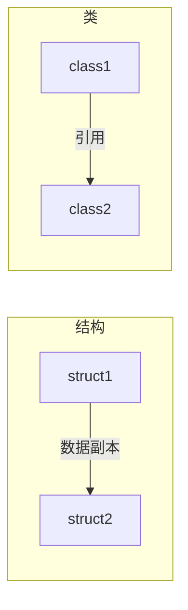

# 1.什么是结构，为什么需要结构
结构是数值类型版本的类：
- 结构也有数据成员和函数成员
- 结构是数值类型
- 结构是隐式密封的，所以结构不能被继承


结构与类大部分都类似，
- 都有数据成员和函数成员
- 都可以实现接口
- 都可以分部声明
但结构：
- 与类相比有更小的开销
- 但需要装箱和拆箱的损耗

**预定义简单类型都是用结构实现的。**（如int，long，float，char,bool等。。)

结构声明的语法
```C#
struct StructName
{
MemberDeclarations;
}

```
# 2.结构是数值类型的

结构是数值类型意味着，结构变量存储这其对应的数据，他们都存储在堆中。
- 结构类型的变量不能是null

将一个结构赋值给另一个与将一个类赋值给另一个类的区别：



# 3.结构和初始化以及创建结构实例

## 1.结构的初始化
- 结构一般在其创建实例后再进行字段和属性的赋值；
- 非静态属性和字段不能在结构内部声明时初始化，
- 静态字段和静态属性可以，即使结构不是静态的。

```C#
struct Sample
{
public int a = 5; // 禁止，不能在结构中初始化
public int Number {set;get;} = 5; //禁止；

static public int b = 4; //静态结构允许
static public int Number2 {set;get;} = 5; //允许；


}
```

## 2.创建结构实例

### 1.直接创建实例
创建结构是可以用 `Type StructName1, StuctName2;`的方式直接创建，但此种方式：
- 需要显式的为成员赋值后才能使用他们
- 在所有数据成员都赋值后才能使用函数成员

示例：
```C#
struct Sample
{
public int X;
public int Y;
public void Method1(){...}
}

static void Main()
{
Sample Sample1, Sample2;
Sample1.X = 5;
Sample1.Y = 6;
Sample1.Method1; //在所有数据成员都赋值后才能使用函数成员
...
}
```

### 2.通过构造函数创建


**结构的构造函数特点：**

每个结构都有一个默认不带任何参数的构造函数，会将所有成员设置为该类型默认值：
- 数值类型为0
- 引用类型为null

默认构造函数是预定义的，不能删除或重定义。
用户可以自己创建其他的带参数的构造函数。

与类不同的是：
- 类是没有任何构造函数时才会有默认隐式构造函数
- 结构是始终存在默认构造函数


**new运算符调用构造函数**:

即使结构是数值类型，不需要在堆中创建存储空间，但结构仍需要使用new 来调用构造函数。

```C#
struct Sample
{
public int X;
public int Y;
public void Method1(){...}

public Sample(int a, int b)
{
X = a;
Y = b;
}
}


static void Main()
{
Sample Sample1 = new Sample();  //调用隐式默认构造函数
Sample Sample2 = new Sample(3,4);  //调用用户自定义构造函数

}
```


## 3.静态构造函数

静态构造函数只能处理静态成员。
**允许有不带参数的静态构造函数**

## 4.析构函数不能在结构中声明


# 4.结构是密封的

因为结构是密封的，所以结构不能派生其他结构；

也因此有些修饰符不能使用：
- protected （无派生）
- internal protected（无派生）
- sealed（已是隐式密封）
- virtual（无派生）
- abstract（无派生）

**结构本身是派生自System.ValueType；而System.ValueType派生自object；**
**所以结构可以使用override修饰符，修改System.valueType的成员。**


# 5.结构作为返回值和参数

- 结构作为返回值时返回的是结构的副本。

- 结构作为参数时，传入的也是结构的副本。

- 当使用ref和out参数时，可以创建结构的引用，这样就可以改变结构的成员。

# 6.装箱和拆箱

